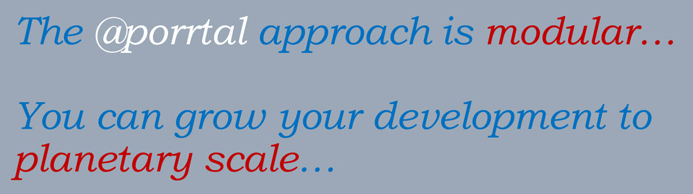

# Porrtal

Welcome to the Porrtal project !!

This project was created to help developers. You can use the platform to build web applications. The project supports both React and Angular development. You can also use the Porrtal code as a reference showing how to use React, BlueprintJS, Material (MUI), Angular, and Angular Material.

## Porrtal Quick Starts

The quick starts listed here are designed to get you up and running quickly.

|  | [React Quick Start - BlueprintJS](libs/porrtal-components/r-quick-start-blueprint/porrtal-components-r-quick-start-blueprint/quick-start.md)  |
| ----------------------------------------------------------------------- | --------------------------------------------------------------------------------------------------------------------------------------------- |
|                  | [React Quick Start - Material (MUI)](libs/porrtal-components/r-quick-start-material/porrtal-components-r-quick-start-material/quick-start.md) |
|              | [Angular Quick Start - Material](libs/porrtal-components/a-quick-start-material/porrtal-components-a-quick-start-material/quick-start.md)     |

## Porrtal Website

The Porrtal project website can be found here: [porrtal.io](https://porrtal.io) (coming soon...)

You can follow these steps to run the Porrtal website locally:

```bash
# clone the repo
git clone https://github.com/Comcast/Porrtal/Porrtal.git

# switch to the folder
cd Porrtal

# install npm packages
npm install --legacy-peer-deps

# serve the app
nx serve n-porrtal-io-app
```

Once the above command completes, you can run the website locally in your browser [http://localhost:4200](http://localhost:4200)

## Porrtal NPM Packages

Porrtal NPM Packages can be found here: [www.npmjs.com/search?q=@porrtal](https://www.npmjs.com/search?q=%40porrtal)

_@porrtal is a set of npm packages that can be used to rapidly construct spatial / analytics systems for power users._

(@porrtal provides npm packages for both Angular and React development)

## The Porrtal Mission

### @porrtal project - Build Better Outcomes

The goal of the Porrtal project is to assist developers in building better outcomes by

1. Increasing developer velocity;
2. Enabling delivery of more powerful web applications;
3. Providing a more powerful navigation model; and
4. Facilitating an integrated application experience through modular component composition.

&nbsp;


&nbsp;
&nbsp;



## Porrtal Platform Overview

Lets start with an overview of a typical Porrtal web application. You build your components and plug them in to the Porrtal platform.

Here's a sketch of a Porrtal web application.


Several Porrtal "Panes" ("nav" pane, "main" pane, and "search" pane) are shown in the above diagram. These are the regions where your components can be placed.

Youre components are independent and reusable bits of code that typically occupy a rectangular area of the UI.

When building a Porrtal app, you will define an array of Porrtal "Views". Each Porrtal View object in the array references one of your components. The View object also includes properties like icon, display text, pane, and more. The View object helps Porrtal load your components into the Porrtal app.

On the left, you can see the nav pane. The first nav view is the quick start outline. The second is the Account Nav component we will be building. You can switch between these components by clicking on the icons on the far left.

To see the search pane, start typing some text in top right text box. The search pane will popup and show the results of the search based on the text you type. As you change the text, the search component will change the displayed results.

A Porrtal view can be dynamically launched by the code in a component. Porrtal also provides a more advanced launch feature where an (entity) menu of launch options is displayed. You can see more about the Entity Menu in the Quick Starts above.

## Porrtal Apps - Adding Authentication

[See "Porrtal Libraries" Readme](./libs/porrtal/README.md)

# Porrtal Development

This project was generated using [Nx](https://nx.dev).

<p style="text-align: left;"></p>

🔎 **Smart, Fast and Extensible Build System**

## Adding capabilities to your workspace

Nx supports many plugins which add capabilities for developing different types of applications and different tools.

These capabilities include generating applications, libraries, etc as well as the devtools to test, and build projects as well.

Below are our core plugins:

- [React](https://reactjs.org)
  - `npm install --save-dev @nx/react`
- Web (no framework frontends)
  - `npm install --save-dev @nx/web`
- [Angular](https://angular.io)
  - `npm install --save-dev @nx/angular`
- [Nest](https://nestjs.com)
  - `npm install --save-dev @nrwl/nest`
- [Express](https://expressjs.com)
  - `npm install --save-dev @nrwl/express`
- [Node](https://nodejs.org)
  - `npm install --save-dev @nrwl/node`

There are also many [community plugins](https://nx.dev/community) you could add.

## Generate an application

Run `nx g @nx/react:app my-app` to generate an application.

> You can use any of the plugins above to generate applications as well.

When using Nx, you can create multiple applications and libraries in the same workspace.

## Generate a library

Run `nx g @nx/react:lib my-lib` to generate a library.

> You can also use any of the plugins above to generate libraries as well.

Libraries are shareable across libraries and applications. They can be imported from `@porrtal-workspace/mylib`.

## Development server

Run `nx serve my-app` for a dev server. Navigate to http://localhost:4200/. The app will automatically reload if you change any of the source files.

## Code scaffolding

Run `nx g @nx/react:component my-component --project=my-app` to generate a new component.

## Build

Run `nx build my-app` to build the project. The build artifacts will be stored in the `dist/` directory. Use the `--prod` flag for a production build.

## Running unit tests

Run `nx test my-app` to execute the unit tests via [Jest](https://jestjs.io).

Run `nx affected:test` to execute the unit tests affected by a change.

## Running end-to-end tests

Run `nx e2e my-app` to execute the end-to-end tests via [Cypress](https://www.cypress.io).

Run `nx affected:e2e` to execute the end-to-end tests affected by a change.

## Understand your workspace

Run `nx graph` to see a diagram of the dependencies of your projects.

## Further help

Visit the [Nx Documentation](https://nx.dev) to learn more.

## ☁ Nx Cloud

### Distributed Computation Caching & Distributed Task Execution

<p style="text-align: left;"></p>

Nx Cloud pairs with Nx in order to enable you to build and test code more rapidly, by up to 10 times. Even teams that are new to Nx can connect to Nx Cloud and start saving time instantly.

Teams using Nx gain the advantage of building full-stack applications with their preferred framework alongside Nx’s advanced code generation and project dependency graph, plus a unified experience for both frontend and backend developers.

Visit [Nx Cloud](https://nx.app/) to learn more.

## License

This project is licensed under the [Apache 2.0](LICENSE-Apache-2.0) license.
