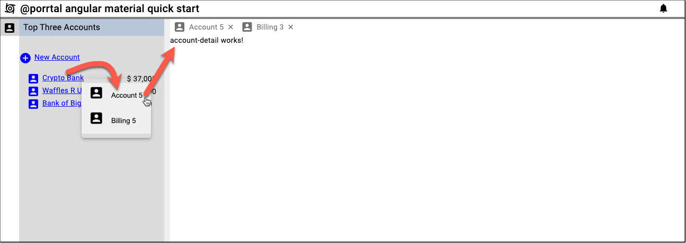

# Create an Entity Menu

### Create `AccountBillingHistory` component in the `account` folder

```bash
ng generate component account/account-billing-history
```

### Create `AccountDetail` component in the `account` folder

```bash
ng generate component account/account-detail
```

### Register `account` "entityType views" in `app.component.ts`

There may be times when you would like the text in the entity menu to be different from the text displayed in the 
tab for the view.  An example of this is shown for the Account view in the following code.  Notice that the 
Billing view does not define entityTypeMenuText, so displayText is used for its entity menu.

```ts
import { Component } from '@angular/core';
import { BannerData, ShellStateService } from '@porrtal/a-shell';
import { View } from '@porrtal/a-api';

const views: View[] = [
  {
    key: 'AccountNav',
    launchAtStartup: true,
    displayText: 'Account Navigation',
    paneType: 'nav',
    displayIcon: 'account_box',
    componentName: 'AccountNavComponent',
    componentModule: () =>
      import('./account/account-nav/account-nav.component'),
  },
  {
    displayText: 'Create Account',
    displayIcon: 'account_box',
    componentName: 'NewAccountComponent',
    componentModule: () =>
      import('./account/new-account/new-account.component'),
  },
  {
    key: 'Account {accountId}',
    displayText: 'Account {accountId}',
    entityTypeMenuText: 'Acct {accountId}',
    displayIcon: 'account_box',
    componentName: 'AccountDetailComponent',
    entityType: 'account',
    componentModule: () =>
      import('./account/account-detail/account-detail.component'),
  },
  {
    key: 'Billing {accountId}',
    displayText: 'Billing {accountId}',
    displayIcon: 'account_box',
    componentName: 'AccountBillingHistoryComponent',
    entityType: 'account',
    componentModule: () =>
      import(
        './account/account-billing-history/account-billing-history.component'
      ),
  },
];

@Component({
  selector: 'app-root',
  templateUrl: './app.component.html',
  styleUrls: ['./app.component.css'],
})
export class AppComponent {
  public bannerData: BannerData = {
    displayText: '@porrtal angular material quick start',
    displayIcon: 'cyclone',
  };

  constructor(public shellStateService: ShellStateService) {
    views.forEach((view) =>
      shellStateService.dispatch({
        type: 'registerView',
        view,
      })
    );

    shellStateService.dispatch({
      type: 'launchStartupViews',
    });
  }
}
```

### Update `account-nav.component.html` with the EntityMenu

```html
<div class="container">
  <h3 class="title">Top Three Accounts</h3>
  <div class="new-account-container">
    <span
      class="link-button"
      style="display: grid; grid-template-columns: 24px auto"
      (click)="
        shellStateService.dispatch({
          type: 'launchView',
          viewId: 'NewAccountComponent'
        })
      "
    >
      <mat-icon>add_circle</mat-icon>
      <span style="margin-left: '5px'">New Account</span>
    </span>
  </div>
  <div class="data-container">
    <ng-container *ngFor="let account of topThreeAccounts">
      <porrtal-entity-menu
        entityType="account"
        [state]="{ accountId: account.accountId }"
      >
        <span
          class="link-button"
          style="display: grid; grid-template-columns: 24px auto"
        >
          <mat-icon>account_box</mat-icon>
          <span style="margin-left: 5px">{{ account.name }}</span>
        </span>
      </porrtal-entity-menu>
      <span>
        $
        {{
          account.total
            | number
              : "1.0-0" //.toFixed(0).replace(/(\d)(?=(\d{3})+(?!\d))/g, '$1,')
        }}
      </span>
    </ng-container>
  </div>
</div>
```

### Update `account-nav.component.ts` with EntityMenuComponent import

```ts
import { CommonModule } from '@angular/common';
import { Component, Input } from '@angular/core';
import { EntityMenuComponent } from '@porrtal/a-shell-material';
import { MatIconModule } from '@angular/material/icon';
import { ViewState } from '@porrtal/a-api';
import { Account, accountData } from '../../data/account-data';
import { ShellStateService } from '@porrtal/a-shell';

@Component({
  selector: 'app-account-nav',
  standalone: true,
  imports: [CommonModule, MatIconModule, EntityMenuComponent],
  templateUrl: './account-nav.component.html',
  styleUrls: ['./account-nav.component.css'],
})
export class AccountNavComponent {
  @Input() viewState?: ViewState;

  public topThreeAccounts: (Account & { total: number })[] = [];
  constructor(public shellStateService: ShellStateService) {
    this.topThreeAccounts = [
      ...accountData
        .map((account) => {
          const total = account.orders.reduce((accumulator, order) => {
            return accumulator + order.amount;
          }, 0);
          return {
            ...account,
            total,
          };
        })
        .sort((a, b) => b.total - a.total)
        .filter((acct, ii) => ii < 3),
    ];

    console.log('top three accounts', this.topThreeAccounts);
  }
}
```

### No changes to `AccountNav.css`

```css
.container {
  display: grid;
  grid-template-columns: 1fr;
}

.title {
  background-color: rgb(185, 199, 218);
  margin: 0;
  padding-top: 2px;
  padding-bottom: 2px;
  padding-left: 8px;
  grid-column: 1 / -1;
}

.new-account-container {
  margin-top: 30px;
}

.data-container {
  display: grid;
  grid-template-columns: 1fr auto;
  align-items: center;
  margin-left: 15px;
  margin-right: 15px;
  margin-top: 15px;
}

.link-button {
  color: blue;
  text-decoration: underline;
  cursor: pointer;
}
```

### At this point, we can test the entity menu by clicking on the account in the Account Nav.



## Now we fill in Account Detail implementation

### Update `account-detail.component.css` file in `account` folder

```css
.container {
  display: grid;
  grid-template-columns: 1fr;
}

.title {
  background-color: rgb(185, 199, 218);
  margin: 0;
  padding-top: 2px;
  padding-bottom: 2px;
  padding-left: 8px;
  grid-column: 1 / -1;
}

.data-container {
  display: grid;
  justify-self: start;
  gap: 10px;
  grid-template-columns: auto auto auto;
  margin-left: 15px;
  margin-right: 15px;
  margin-top: 15px;
}

.link-button {
  color: blue;
  text-decoration: underline;
  cursor: pointer;
}
```

### Install `moment` npm package (for date / time functions)

```bash
npm install moment --save --legacy-peer-deps
```

### Update `account-detail.component.html` to show data for the Account

```html
<div class="container">
  <h3 class="title">
    {{ account?.name }} ({{ account?.accountId }}) - Account Detail
  </h3>
  <div class="data-container">
    <ng-container *ngFor="let order of orders">
      <span>{{ order.item }}</span>
      <span>
        {{ order.amountText }}
      </span>
      <span>{{ Moment(order.date).format("YYYY-DD-MM") }}</span>
    </ng-container>
  </div>
</div>
```

### Update `account-detail.component.ts`

```ts
import { Component, Input } from '@angular/core';
import { ViewState } from '@porrtal/a-api';
import { Account, accountData, AccountOrder } from '../../data/account-data';
import * as Moment from 'moment';
import { CommonModule } from '@angular/common';
import { MatIconModule } from '@angular/material/icon';

@Component({
  selector: 'app-account-detail',
  standalone: true,
  imports: [CommonModule, MatIconModule],
  templateUrl: './account-detail.component.html',
  styleUrls: ['./account-detail.component.css'],
})
export class AccountDetailComponent {
  private _viewState?: ViewState;
  @Input() set viewState(value: ViewState | undefined) {
    this._viewState = value;
    if (this._viewState?.state && this._viewState?.state['accountId']) {
      const accountId = this._viewState?.state['accountId'];
      this.account = accountData.find(
        (account) => account.accountId === accountId
      );
      this.orders = [];
      if (this.account) {
        this.orders = this.account.orders.map((order) => ({
          ...order,
          amountText:
            '$' +
            order.amount.toFixed(0).replace(/(\d)(?=(\d{3})+(?!\d))/g, '$1,'),
        }));
      }
    }
  }
  get viewState() {
    return this._viewState;
  }

  public Moment = Moment;
  public account?: Account;
  public orders?: (AccountOrder & { amountText: string })[];
}
```

### Success !! 


