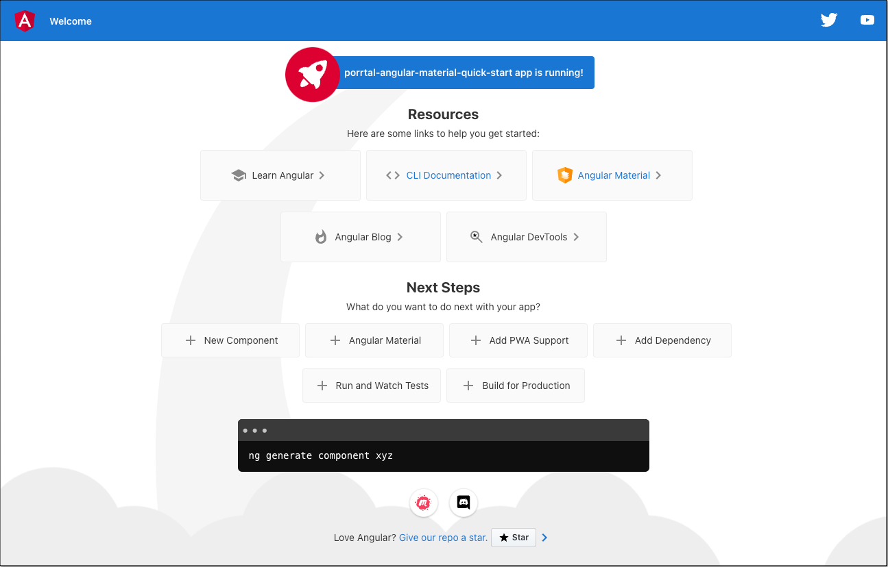

# Create the App

## ng new

In this tutorial, we will jump start our development using the @angular/cli `ng`.

You can find excellent documentation here
[angular.io/cli](https://angular.io/cli)

In the command below, a long project name was chosen to differentiate this app from other versions of the quick start - feel free to choose a project name you like.

### Open a terminal window

[PowerShell](https://learn.microsoft.com/en-us/powershell/) on Windows,

[Terminal](https://support.apple.com/guide/terminal/welcome/mac) on Mac

### Install the Angular CLI

```bash
npm install -g @angular/cli
```

### Create the app

```bash
ng new porrtal-angular-material-quick-start --routing false --style css
```

### Change into the newly created directory

```bash
cd porrtal-angular-material-quick-start
```

### Now run the app.

```bash
ng serve
```

### View in the browser

You can click the link to view the new Angular app in your browser:
[https://localhost:4200](https://localhost:4200)



Note: Angular uses the [TypeScript](https://www.typescriptlang.org/) language. TypeScript is an excellent language choice for large scale development.

### Run the VS Code app

From VS Code, open the folder `porrtal-angular-material-quick-start` (or whatever app name you chose above).

You should see something like this:


