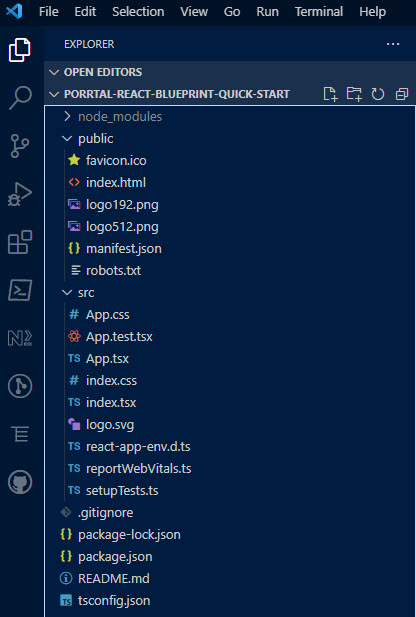

# Create the App

## create-react-app

In this tutorial, we will jump start our development using create-react-app.

You can find excellent documentation here
[create-react-app.dev](https://create-react-app.dev)

In the command below, a long project name was chosen to differentiate this app from other versions of the quick start - feel free to choose a project name you like.

### Open a terminal window

[PowerShell](https://learn.microsoft.com/en-us/powershell/) on Windows, 

[Terminal](https://support.apple.com/guide/terminal/welcome/mac) on Mac

### Create the app

```bash
npx create-react-app porrtal-react-blueprint-quick-start --template typescript
```

### Change into the newly created directory

```bash
cd porrtal-react-blueprint-quick-start
```

### Now run the app.

```bash
npm run start
```

A browser should appear with the new react app.  You can also click the link to view the new react app in your browser: 
[https://localhost:3000](https://localhost:3000)


Note: We are using the [TypeScript](https://www.typescriptlang.org/) template.  TypeScript is an excellent language choice for large scale development.

### Run the VS Code app

From VS Code, open the folder `porrtal-react-blueprint-quick-start` (or whatever app name you chose above).  

You should see something like this:


