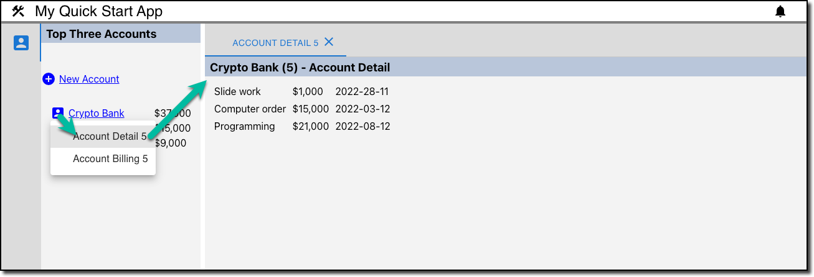

# Create an Entity Menu

### Create `AccountBilling.tsx` file in `Account` folder

```tsx
export function AccountBilling() {
    return (<div>Account Billing</div>);
}

export default AccountBilling;
```

### Create `AccountDetail.tsx` file in `Account` folder

```tsx
export function AccountDetail() {
    return (<div>Account Detail</div>);
}

export default AccountDetail;
```

### Register AccountBilling and AccountDetail views in `App.tsx`

```tsx
import { View } from "@porrtal/r-api";
import { BannerData, ShellState } from "@porrtal/r-shell";
import { ShellMaterial } from "@porrtal/r-shell-material";

import "./App.css";

function App() {
  const porrtalViews: View[] = [
    {
      key: "AccountNav",
      launchAtStartup: true,
      displayText: "Account Navigation",
      paneType: "nav",
      displayIcon: "account_box",
      componentName: "AccountNav",
      componentModule: () => import("./Account/AccountNav"),
    },
    {
      viewId: "NewAccount",
      key: "NewAccount",
      displayText: "New Account",
      paneType: "main",
      displayIcon: "add",
      componentName: "NewAccount",
      componentModule: () => import("./Account/NewAccount"),
    },
    {
      viewId: "AccountDetail",
      key: 'Account Detail {accountId}',
      displayText: 'Account Detail {accountId}',
      paneType: "main",
      displayIcon: "mugshot",
      componentName: "AccountDetail",
      entityType: "account",
      componentModule: () => import("./Account/AccountDetail"),
    },
    {
      viewId: "AccountBilling",
      key: 'Account Billing {accountId}',
      displayText: 'Account Billing {accountId}',
      paneType: "main",
      displayIcon: "mugshot",
      componentName: "AccountBilling",
      entityType: "account",
      componentModule: () => import("./Account/AccountBilling"),
    },
  ];
  const porrtalBanner: BannerData = {
    displayText: "My Quick Start App",
    displayIcon: "construction",
    childData: []
  };
  return (
    <ShellState views={porrtalViews}>
      <ShellMaterial bannerData={porrtalBanner} />
    </ShellState>
  );
}

export default App;
```

### Update `AccountNav.tsx` with the EntityMenu

```tsx
import { Icon } from "@mui/material";
import { EntityMenu, useShellDispatch } from "@porrtal/r-shell";
import { Fragment } from "react";
import { accountData } from "../Data/AccountData";
import "./AccountNav.css";

/* eslint-disable-next-line */
export interface AccountNavProps {}

export function AccountNav(props: AccountNavProps) {
  const shellDispatch = useShellDispatch();
  return (
    <div className="AccountNav_container">
      <h3 className="AccountNav_title">Top Three Accounts</h3>
      <div className="AccountNav_new-account-container">
        <p
          className="AccountNav_link-button"
          onClick={() =>
            shellDispatch({ type: "launchView", viewId: "NewAccount" })
          }
        >
          <Icon>add_circle</Icon>
          <span style={{ marginLeft: "5px" }}>New Account</span>
        </p>
      </div>
      <div className="AccountNav_data-container">
        {accountData
          .map((account) => {
            const total = account?.orders.reduce((accumulator, order) => {
              return accumulator + order.amount;
            }, 0);
            return {
              ...account,
              total,
            };
          })
          .sort((a, b) => b.total - a.total)
          .filter((acct, ii) => ii < 3)
          .map((acct) => {
            return (
              <Fragment key={acct.accountId}>
                <EntityMenu
                  entityType="account"
                  state={{ accountId: acct.accountId }}
                >
                  <span className="AccountNav_link-button">
                    <Icon>account_box</Icon>
                    <span style={{ marginLeft: "5px" }}>{acct.name}</span>
                  </span>
                </EntityMenu>
                <span>
                  {"$" +
                    acct.total
                      .toFixed(0)
                      .replace(/(\d)(?=(\d{3})+(?!\d))/g, "$1,")}
                </span>
              </Fragment>
            );
          })}
      </div>
    </div>
  );
}

export default AccountNav;
```

### Update `AccountNav.css`

```css
.AccountNav_container {
  display: grid;
  grid-template-columns: 1fr;
}

.AccountNav_title {
  background-color: rgb(185, 199, 218);
  margin: 0;
  padding-top: 5px;
  padding-bottom: 4px;
  padding-left: 8px;
  grid-column: 1 / -1;
}

.AccountNav_new-account-container {
  margin-top: 30px;
}

.AccountNav_data-container {
  display: grid;
  grid-template-columns: 1fr auto;
  align-items: center;
  margin-left: 15px;
  margin-right: 15px;
  margin-top: 15px;
}

.AccountNav_link-button {
  color: blue;
  text-decoration: underline;
  cursor: pointer;
  display: grid;
  grid-template-columns: auto auto 1fr;
  justify-items: flex-end;
  align-items: center;
}
```

### At this point, we can test the entity menu by clicking on the account in the Account Nav.

## Now we fill in Account Detail implementation

Next we will add detail to the Account Details page, picking up the accountId from the `state` property in the `viewState` property.

### Add `AccountDetail.css` file in `Account` folder

```css
.AccountDetail_container {
  display: grid;
  grid-template-columns: 1fr;
}

.AccountDetail_title {
  background-color: rgb(185, 199, 218);
  margin: 0;
  padding-top: 5px;
  padding-bottom: 4px;
  padding-left: 8px;
  grid-column: 1 / -1;
}

.AccountDetail_data-container {
  display: grid;
  justify-self: start;
  gap: 10px;
  grid-template-columns: auto auto auto;
  margin-left: 15px;
  margin-right: 15px;
  margin-top: 15px;
}

.AccountDetail_link-button {
  color: blue;
  text-decoration: underline;
  cursor: pointer;
}
```

### Install `moment` npm package (for date / time functions)

```bash
npm install moment --save 
```

### Update `AccountDetail.tsx` to show data for the Account

```tsx
import { ViewComponentProps } from "@porrtal/r-api";
import { Fragment } from "react";
import { accountData } from "../Data/AccountData";
import "./AccountDetail.css";
import Moment from "moment";

export function AccountDetail(props: ViewComponentProps) {
  const account = accountData.find(
    (acct) => acct.accountId === props.viewState?.state?.["accountId"]
  );

  if (account === null) {
    return (
      <div>
        <span>accountId:&nbsp;</span>
        <span>{`${props.viewState?.state?.["accountId"]}`}</span>
        <span>&nbsp;not found.</span>
      </div>
    );
  }

  return (
    <div className="AccountDetail_container">
      <h3 className="AccountDetail_title">
        {account?.name} ({account?.accountId}) - Account Detail
      </h3>
      <div className="AccountDetail_data-container">
        {account?.orders.map((order, index) => (
          <Fragment key={index}>
            <span>{order.item}</span>
            <span>
              {"$" +
                order.amount
                  .toFixed(0)
                  .replace(/(\d)(?=(\d{3})+(?!\d))/g, "$1,")}
            </span>
            <span>{Moment(order.date).format("YYYY-DD-MM")}</span>
          </Fragment>
        ))}
      </div>
    </div>
  );
}

export default AccountDetail;
```

### Success !! 


