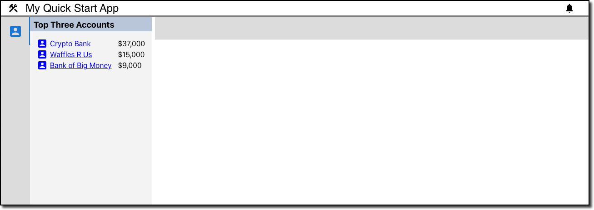

# Create the AccountNav Component

Next, we will turn our generic React app into a Porrtal app with a simple Nav view that displays (mock) account data. We will also set the stage for developing with the [blueprint](https://blueprintjs.com/docs/) UI library.

## Install npm packages

### Install material npm packages

From the terminal (in the porrtal-react-material-quick-start directory):

```bash
npm install @mui/material @emotion/react @emotion/styled mui-nested-menu --save
```

### Install porrtal npm packages

```bash
npm install @porrtal/r-api @porrtal/r-shell @porrtal/r-shell-material @porrtal/r-split --save --legacy-peer-deps
```

```bash
npm install ag-grid-community ag-grid-react uuid react-measure --save --legacy-peer-deps
```

```bash
npm install @types/uuid @types/react-measure --save-dev --legacy-peer-deps
```

## Modify `public/index.html` to include Material Icons Font

```html
<!DOCTYPE html>
<html lang="en">
  <head>
    <meta charset="utf-8" />
    <link rel="icon" href="%PUBLIC_URL%/favicon.ico" />
    <meta name="viewport" content="width=device-width, initial-scale=1" />
    <meta name="theme-color" content="#000000" />
    <meta
      name="description"
      content="Web site created using create-react-app"
    />
    <link rel="apple-touch-icon" href="%PUBLIC_URL%/logo192.png" />
    <!--
      manifest.json provides metadata used when your web app is installed on a
      user's mobile device or desktop. See https://developers.google.com/web/fundamentals/web-app-manifest/
    -->
    <link rel="manifest" href="%PUBLIC_URL%/manifest.json" />
    <!--
      Notice the use of %PUBLIC_URL% in the tags above.
      It will be replaced with the URL of the `public` folder during the build.
      Only files inside the `public` folder can be referenced from the HTML.

      Unlike "/favicon.ico" or "favicon.ico", "%PUBLIC_URL%/favicon.ico" will
      work correctly both with client-side routing and a non-root public URL.
      Learn how to configure a non-root public URL by running `npm run build`.
    -->
    <link
      rel="stylesheet"
      href="https://fonts.googleapis.com/icon?family=Material+Icons|Material+Icons+Outlined"
    />
    <title>React App</title>
  </head>
  <body>
    <noscript>You need to enable JavaScript to run this app.</noscript>
    <div id="root"></div>
    <!--
      This HTML file is a template.
      If you open it directly in the browser, you will see an empty page.

      You can add webfonts, meta tags, or analytics to this file.
      The build step will place the bundled scripts into the <body> tag.

      To begin the development, run `npm start` or `yarn start`.
      To create a production bundle, use `npm run build` or `yarn build`.
    -->
  </body>
</html>```

## Modify App.tsx

```tsx
import { View } from "@porrtal/r-api";
import { BannerData, ShellState } from "@porrtal/r-shell";
import { ShellMaterial } from "@porrtal/r-shell-material";

import "./App.css";

function App() {
  const porrtalViews: View[] = [
    {
      key: "AccountNav",
      launchAtStartup: true,
      displayText: "Account Navigation",
      paneType: "nav",
      displayIcon: "account_box",
      componentName: "AccountNav",
      componentModule: () => import("./Account/AccountNav"),
    },
  ];
  const porrtalBanner: BannerData = {
    displayText: "My Quick Start App",
    displayIcon: "construction",
    childData: []
  };
  return (
    <ShellState views={porrtalViews}>
      <ShellMaterial bannerData={porrtalBanner} />
    </ShellState>
  );
}

export default App;
```

## Create AccountNav component

Create a folder `Account` at the same level as `App.tsx`

Create a file `AccountNav.tsx` in the `Account` folder.

```ts
export function AccountNav() {
    return (<div>Account Nav</div>);
}

export default AccountNav;
```

## Run the app

Open a terminal window, change into the application folder, and run this command:

```bash
npm start
```

## Success !!  Porrtal with your AccountNav View


## Create some mock Account data

Create a folder `Data` at the same level as `App.tsx`

Create a file `AccountData.ts` in the `Data` folder.

```ts
export const accountData = [
  {
    accountId: 1,
    name: "Bank of Big Money",
    orders: [
      {
        date: Date.now(),
        item: "Screen design",
        amount: 1000,
      },
      {
        date: Date.now() + 1000 * 60 * 60 * 24 * 5,
        item: "Screen development",
        amount: 5000,
      },
      {
        date: Date.now() + 1000 * 60 * 60 * 24 * 10,
        item: "Screen testing",
        amount: 3000,
      },
    ],
  },
  {
    accountId: 2,
    name: "Bill Jones",
    orders: [
      {
        date: Date.now(),
        item: "Slide development",
        amount: 1000,
      },
    ],
  },
  {
    accountId: 3,
    name: "Waffles R Us",
    orders: [
      {
        date: Date.now(),
        item: "Screen design",
        amount: 2000,
      },
      {
        date: Date.now() + 1000 * 60 * 60 * 24 * 5,
        item: "Screen development",
        amount: 8000,
      },
      {
        date: Date.now() + 1000 * 60 * 60 * 24 * 10,
        item: "Screen testing",
        amount: 5000,
      },
    ],
  },
  {
    accountId: 4,
    name: "Waffle House",
    orders: [
      {
        date: Date.now(),
        item: "Screen design",
        amount: 500,
      },
      {
        date: Date.now() + 1000 * 60 * 60 * 24 * 5,
        item: "Screen development",
        amount: 2000,
      },
    ],
  },
  {
    accountId: 5,
    name: "Crypto Bank",
    orders: [
      {
        date: Date.now(),
        item: "Slide work",
        amount: 1000,
      },
      {
        date: Date.now() + 1000 * 60 * 60 * 24 * 5,
        item: "Computer order",
        amount: 15000,
      },
      {
        date: Date.now() + 1000 * 60 * 60 * 24 * 10,
        item: "Programming",
        amount: 21000,
      },
    ],
  },
];
```

## Create `AccountNav.css`

Create a file `AccountNav.css` in the `Account` folder.

```css
.AccountNav_container {
    display: grid;
    grid-template-columns: 1fr;
  }
  
  .AccountNav_title {
    background-color: rgb(185, 199, 218);
    margin: 0;
    padding-top: 5px;
    padding-bottom: 4px;
    padding-left: 8px;
    grid-column: 1 / -1;
  }
  
  .AccountNav_data-container {
    display: grid;
    grid-template-columns: 1fr auto;
    align-items: center;
    margin-left: 15px;
    margin-right: 15px;
    margin-top: 15px;
  }
  
  .AccountNav_link-button {
    color: blue;
    text-decoration: underline;
    cursor: pointer;
    display: grid;
    grid-template-columns: auto auto 1fr;
    justify-items: flex-end;
    align-items: center;
  }
  ```

## Update `AccountNav.tsx`

```ts
import { Icon } from "@mui/material";
import { Fragment } from "react";
import { accountData } from "../Data/AccountData";
import "./AccountNav.css";

/* eslint-disable-next-line */
export interface AccountNavProps {}

export function AccountNav(props: AccountNavProps) {
  return (
    <div className="AccountNav_container">
      <h3 className="AccountNav_title">Top Three Accounts</h3>
      <div className="AccountNav_data-container">
        {accountData
          .map((account) => {
            const total = account?.orders.reduce((accumulator, order) => {
              return accumulator + order.amount;
            }, 0);
            return {
              ...account,
              total,
            };
          })
          .sort((a, b) => b.total - a.total)
          .filter((acct, ii) => ii < 3)
          .map((acct) => {
            return (
              <Fragment key={acct.accountId}>
                <span className="AccountNav_link-button">
                  <Icon>account_box</Icon>
                  <span style={{ marginLeft: "5px" }}>{acct.name}</span>
                </span>
                <span>
                  {"$" +
                    acct.total
                      .toFixed(0)
                      .replace(/(\d)(?=(\d{3})+(?!\d))/g, "$1,")}
                </span>
              </Fragment>
            );
          })}
      </div>
    </div>
  );
}

export default AccountNav;
```

## AccountNav View with Account Data


