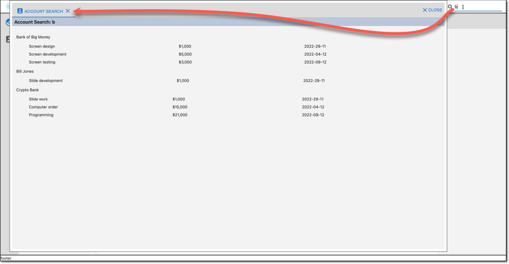

# Create a Search Component

To help your users find what they seek, you can register your components as "Search" Views.  When the user starts typing in the search text box, the search dialog appears with a tab for each registered search view.

NOTE: If there are no registered search views, the search textbox will be hidden.

### Create `AccountSearch.tsx` file in the `Account` folder.

```tsx
import { useDebouncedSearchText } from '@porrtal/r-shell';
import { ViewComponentProps } from '@porrtal/r-api';
import { accountData } from '../Data/AccountData';
import Moment from 'moment';
import { Fragment } from 'react';
import "./AccountSearch.css";

export function AccountSearch(props: ViewComponentProps) {
  const searchText = useDebouncedSearchText();
  return (
    <div className="AccountSearch_container">
      <h3 className="AccountSearch_title">Account Search: {searchText}</h3>
      <div className="AccountSearch_data-container">
        {accountData
          .filter((account) => {
            return (
              JSON.stringify(account)
                .toLowerCase()
                .indexOf(searchText.toLowerCase()) >= 0
            );
          })
          .map((account) => (
            <Fragment key={account.accountId}>
              <div>{account.name}</div>
              <div className="AccountSearch_orders-data-container">
                {account?.orders.map((order, index) => (
                  <Fragment key={index}>
                    <span>{order.item}</span>
                    <span>
                      {'$' +
                        order.amount
                          .toFixed(0)
                          .replace(/(\d)(?=(\d{3})+(?!\d))/g, '$1,')}
                    </span>
                    <span>{Moment(order.date).format('YYYY-DD-MM')}</span>
                  </Fragment>
                ))}
              </div>
            </Fragment>
          ))}
      </div>
    </div>
  );
}

export default AccountSearch;
```

### Create `AccountSearch.css` file in the `Account` folder

```css
.AccountSearch_container {
  display: grid;
  grid-template-columns: 1fr;
}

.AccountSearch_title {
  background-color: rgb(185, 199, 218);
  margin: 0;
  padding-top: 5px;
  padding-bottom: 4px;
  padding-left: 8px;
  grid-column: 1 / -1;
}

.AccountSearch_data-container {
  margin-left: 15px;
  margin-right: 15px;
  margin-top: 30px;
}

.AccountSearch_orders-data-container {
  display: grid;
  justify-self: start;
  gap: 10px;
  grid-template-columns: auto auto auto;
  margin-left: 45px;
  margin-right: 15px;
  margin-top: 15px;
  margin-bottom: 15px;
}

.AccountSearch_link-button {
  color: blue;
  text-decoration: underline;
  cursor: pointer;
}
```

### Update `App.tsx`

```tsx
import { View } from "@porrtal/r-api";
import { BannerData, ShellState } from "@porrtal/r-shell";
import { ShellMaterial } from "@porrtal/r-shell-material";

import "./App.css";

function App() {
  const porrtalViews: View[] = [
    {
      key: "AccountNav",
      launchAtStartup: true,
      displayText: "Account Navigation",
      paneType: "nav",
      displayIcon: "account_box",
      componentName: "AccountNav",
      componentModule: () => import("./Account/AccountNav"),
    },
    {
      viewId: "NewAccount",
      key: "NewAccount",
      displayText: "New Account",
      paneType: "main",
      displayIcon: "add",
      componentName: "NewAccount",
      componentModule: () => import("./Account/NewAccount"),
    },
    {
      viewId: "Account",
      key: 'Account {accountId}',
      displayText: 'Account {accountId}',
      entityTypeMenuText: 'Acct {accountId}',
      paneType: "main",
      displayIcon: "mugshot",
      componentName: "AccountDetail",
      entityType: "account",
      componentModule: () => import("./Account/AccountDetail"),
    },
    {
      viewId: "Billing",
      key: 'Billing {accountId}',
      displayText: 'Billing {accountId}',
      paneType: "main",
      displayIcon: "mugshot",
      componentName: "AccountBilling",
      entityType: "account",
      componentModule: () => import("./Account/AccountBilling"),
    },
    {
      key: 'AccountSearch',
      launchAtStartup: true,
      displayText: 'Account Search',
      paneType: 'search',
      displayIcon: "mugshot",
      componentName: 'AccountSearch',
      componentModule: () => import("./Account/AccountSearch"),
    },
  ];
  const porrtalBanner: BannerData = {
    displayText: "My Quick Start App",
    displayIcon: "construction",
    childData: []
  };
  return (
    <ShellState views={porrtalViews}>
      <ShellMaterial bannerData={porrtalBanner} />
    </ShellState>
  );
}

export default App;
```

### Update `index.css`

```css
html,
body {
  position: absolute;
  top: 0;
  left: 0;
  bottom: 0;
  right: 0;
  margin: 0;
  padding: 0;
  font-family: ui-sans-serif, system-ui, -apple-system, BlinkMacSystemFont,
    Segoe UI, Roboto, Helvetica Neue, Arial, Noto Sans, sans-serif,
    Apple Color Emoji, Segoe UI Emoji, Segoe UI Symbol, Noto Color Emoji;
}

html {
  line-height: 1.5;
}
```

### Success !!


