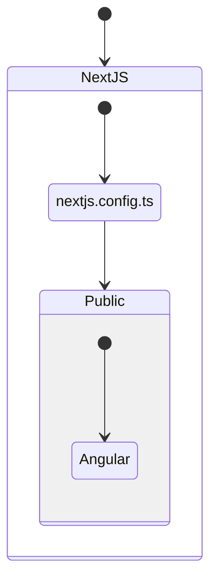

# Hybrid NextJS/Angular App

Using Porrtal, you can create a suite of seamlessly integrated applications.  Each application can be implemented in a NextJS "Page" with React Components or implemented in Angular with Angular "Routes" and Angular Components.

The porrtal-io suite of applications includes starter examples implemented in NextJS/React and in Angular.  The first four in the list are NextJS "Pages" and the last three are Angular Routes in an Angular application.

For the user, each of these items appears to be an integrated application, provided in a seamless UX.

The items can be launched into the current browser tab or into a new tab (by clicking the icon on the right).


## URL/Page Map

| URL | Link to Page |
| --- | ------------ |
| porrtal-io app | [NextJS - pages/index.tsx](../../apps/n/porrtal-io-app/pages/index.tsx) |
| react quick-start | [NextJS - pages/react/quick-start/index.tsx](../../apps/n/porrtal-io-app/pages/react/quick-start/index.tsx) |
| react samples | [NextJS - pages/react/samples/index.tsx](../../apps/n/porrtal-io-app/pages/react/samples/index.tsx) |
| react inside porrtal | [NextJS - pages/react/](../../apps/n/porrtal-io-app/pages/react/inside-porrtal/index.tsx) |
| angular quick-start | [Angular - app/quick-start/quick-start.component.ts](../../apps/a/porrtal-io-app/src/app/quick-start/quick-start.component.ts) |
| angular samples | [Angular - app/samples/samples.component.ts](../../apps/a/porrtal-io-app/src/app/samples/samples.component.ts) |
| angular inside porrtal | [Angular - app/inside-porrtal/inside-porrtal.component.ts](../../apps/a/porrtal-io-app/src/app/inside-porrtal/inside-porrtal.component.ts) |

## NextJS App Contains Angular App(s)



## Build Angular App

```bash
nx build a-porrtal-io-app
```

## Copy Angular Static Website to NextJS public Folder

```bash
cp dist/apps/a/porrtal-io-app/*.* apps/n/porrtal-io-app/public/angular
```

## Set Rewrite Rules for Angular App in NextJS

[apps/n/porrtal-io-app/next.config.js](../../apps/n/porrtal-io-app/jest.config.ts)

We add the `rewrites` property to the `nextConfig` object to allow routes to map to the Angular app's `index.html` webpage.

```js
const nextConfig = {
  nx: {
    // Set this to true if you would like to to use SVGR
    // See: https://github.com/gregberge/svgr
    svgr: false,
  },
  rewrites: () =>
    Promise.resolve([
      {
        source: '/angular/:path*',
        destination: '/angular/index.html',
      },
    ]),
};

module.exports = withNx(nextConfig);
```
