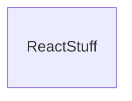
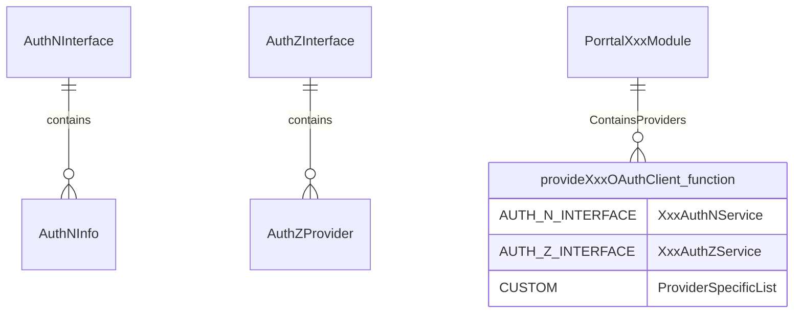
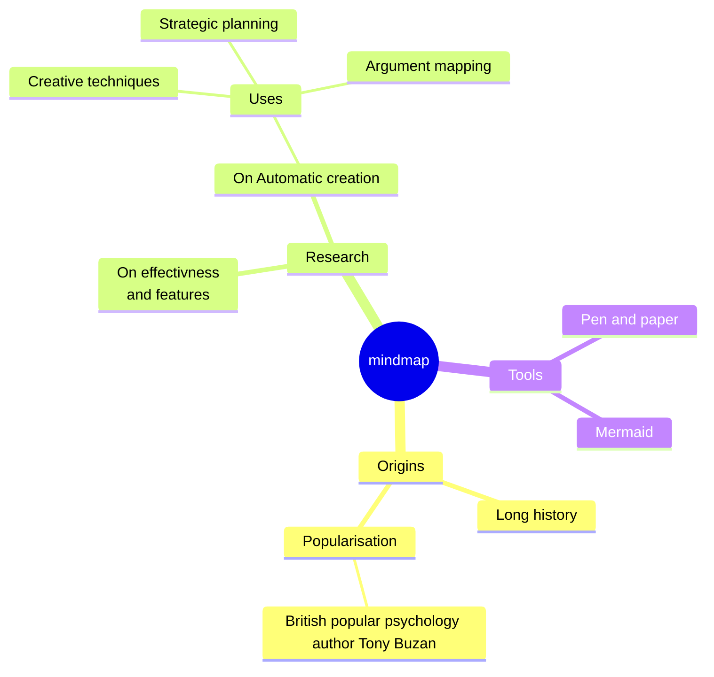

# @porrtal libraries

## react (r-*)

### react authentication and authorization

|library|technology|title|description|
|----|----|----|----|
|r-user|react|authentication and authorization|...|
|r-user-mock|react - mock|mock authentication support (for development)|...|
|r-user-msal|react - azure|microsoft authentication support|...|
|r-user-auth0|react - auth0|react auth0 library support|...|
|r-user-keycloak|react - keycloak|react keycloak library support|...|
|r-user-strapi|react - strapi|strapi authentication support|...|

## angular (a-*)

### Angular Quick Starts

#### Microsoft Azure Authentication (MSAL) Angular

MSAL for Angular enables Angular web applications to authenticate users using Azure AD work and school accounts (AAD), Microsoft personal accounts (MSA) and social identity providers like Facebook, Google, LinkedIn, Microsoft accounts, etc. through Azure AD B2C service. It also enables your app to get tokens to access Microsoft Cloud services such as Microsoft Graph.

##### MSAL Angular Links
* [Microsoft Authentication Library (MSAL)](https://github.com/AzureAD/microsoft-authentication-library-for-js/tree/dev/lib/msal-angular#microsoft-authentication-library-for-angular)
* y

##### MSAL Angular Code Setup

1. [Create Application Module](https://github.com/datumgeek/porrtal/blob/0593c91ccb32b972f4bcf7fbf9be20352684af0f/apps/porrtal-auth/a-msal-app/src/app/app.module.ts#L26-L40)
2. [Create msal-config](https://github.com/datumgeek/porrtal/blob/0593c91ccb32b972f4bcf7fbf9be20352684af0f/apps/porrtal-auth/a-msal-app/src/app/msal-config-example.ts#L18-L38)
1. [Set Permissions in Views](https://github.com/datumgeek/porrtal/blob/0593c91ccb32b972f4bcf7fbf9be20352684af0f/apps/porrtal-auth/a-msal-app/src/app/pages/page-one/page-one.component.ts#L96-L97)
2. [Create Main Component Class](https://github.com/datumgeek/porrtal/blob/0593c91ccb32b972f4bcf7fbf9be20352684af0f/apps/porrtal-auth/a-msal-app/src/app/pages/page-one/page-one.component.ts#L108-L137)

#### OIDC Angular - Keycloak

Keycloak provides open source identity and access management, so that you can add authentication to applications and secure services with minimum effort.

Keycloak provides user federation, strong authentication, user management, fine-grained authorization, and more.

Users authenticate with Keycloak rather than individual applications. This means that your applications don't have to deal with login forms, authenticating users, and storing users. Once logged-in to Keycloak, users don't have to login again to access a different application.

This also applies to logout. Keycloak provides single-sign out, which means users only have to logout once to be logged-out of all applications that use Keycloak.

##### OIDC Angular - Keycloak Links
* [Keycloak Website](https://www.keycloak.org/)
* [OIDC Library](https://github.com/manfredsteyer/angular-oauth2-oidc#angular-oauth2-oidc)

##### OIDC Angular - Keycloak Code Setup

1. [Create Application Module](https://github.com/datumgeek/porrtal/blob/0593c91ccb32b972f4bcf7fbf9be20352684af0f/apps/porrtal-auth/a-keycloak-app/src/app/app.module.ts#L26-L57)
2. [Create msal-config](https://github.com/datumgeek/porrtal/blob/0593c91ccb32b972f4bcf7fbf9be20352684af0f/apps/porrtal-auth/a-oidc-app/src/app/oidc-config-example.ts#L18-L38)
1. [Set Permissions in Views](https://github.com/datumgeek/porrtal/blob/0593c91ccb32b972f4bcf7fbf9be20352684af0f/apps/porrtal-auth/a-oidc-app/src/app/pages/page-one/page-one.component.ts#L96-L97)
2. [Create Main Component Class](https://github.com/datumgeek/porrtal/blob/0593c91ccb32b972f4bcf7fbf9be20352684af0f/apps/porrtal-auth/a-oidc-app/src/app/pages/page-one/page-one.component.ts#L108-L137)

#### OIDC Angular - Auth0

Define access roles for the end-users of your applications and APIs, and extend your authorization capabilities to implement dynamic access control.

##### OIDC Angular - Auth0 Links
* [Auth0 Website](https://auth0.com/)
* [OIDC Library](https://github.com/manfredsteyer/angular-oauth2-oidc#angular-oauth2-oidc)

##### OIDC Angular - Auth0 Code Setup

1. [Create Application Module](https://github.com/datumgeek/porrtal/blob/0593c91ccb32b972f4bcf7fbf9be20352684af0f/apps/porrtal-auth/a-keycloak-app/src/app/app.module.ts#L26-L57)
2. [Create msal-config](https://github.com/datumgeek/porrtal/blob/0593c91ccb32b972f4bcf7fbf9be20352684af0f/apps/porrtal-auth/a-oidc-app/src/app/oidc-config-example.ts#L18-L38)
1. [Set Permissions in Views](https://github.com/datumgeek/porrtal/blob/0593c91ccb32b972f4bcf7fbf9be20352684af0f/apps/porrtal-auth/a-oidc-app/src/app/pages/page-one/page-one.component.ts#L96-L97)
2. [Create Main Component Class](https://github.com/datumgeek/porrtal/blob/0593c91ccb32b972f4bcf7fbf9be20352684af0f/apps/porrtal-auth/a-oidc-app/src/app/pages/page-one/page-one.component.ts#L108-L137)

#### Strapi Angular

Define access roles for the end-users of your applications and APIs, and extend your authorization capabilities to implement dynamic access control.

##### Strapi Angular Links
* [Auth0 Website](https://auth0.com/)
* [OIDC Library](https://github.com/manfredsteyer/angular-oauth2-oidc#angular-oauth2-oidc)

##### Strapi Angular Code Setup

1. [Create Application Module](https://github.com/datumgeek/porrtal/blob/0593c91ccb32b972f4bcf7fbf9be20352684af0f/apps/porrtal-auth/a-keycloak-app/src/app/app.module.ts#L26-L57)
2. [Create msal-config](https://github.com/datumgeek/porrtal/blob/0593c91ccb32b972f4bcf7fbf9be20352684af0f/apps/porrtal-auth/a-oidc-app/src/app/oidc-config-example.ts#L18-L38)
1. [Set Permissions in Views](https://github.com/datumgeek/porrtal/blob/0593c91ccb32b972f4bcf7fbf9be20352684af0f/apps/porrtal-auth/a-oidc-app/src/app/pages/page-one/page-one.component.ts#L96-L97)
2. [Create Main Component Class](https://github.com/datumgeek/porrtal/blob/0593c91ccb32b972f4bcf7fbf9be20352684af0f/apps/porrtal-auth/a-oidc-app/src/app/pages/page-one/page-one.component.ts#L108-L137)

### Angular Authentication and Authorization Libraries (Packages)

|library|technology|title|description|
|----|----|----|----|
|a-user|angular|authentication and authorization|...|
|a-user-auth-z|angular - azure|microsoft authentication support|...|
|a-user-msal|angular - azure|microsoft authentication support|...|
|a-user-oidc|angular - auth0 and keycloak|oidc library support (for auth0 and keycloak)|...|
|a-user-strapi|angular - strapi|strapi authentication support|...|

### Technical Notes

#### PorrtalXxxModule

this is blar

#### provideXxxOAuthClient

for another blar

#### auth n interface

blar

#### auth z interface

blar

#### auth z provider

#### Angular Module and Providers Array

blar

### Diagram

