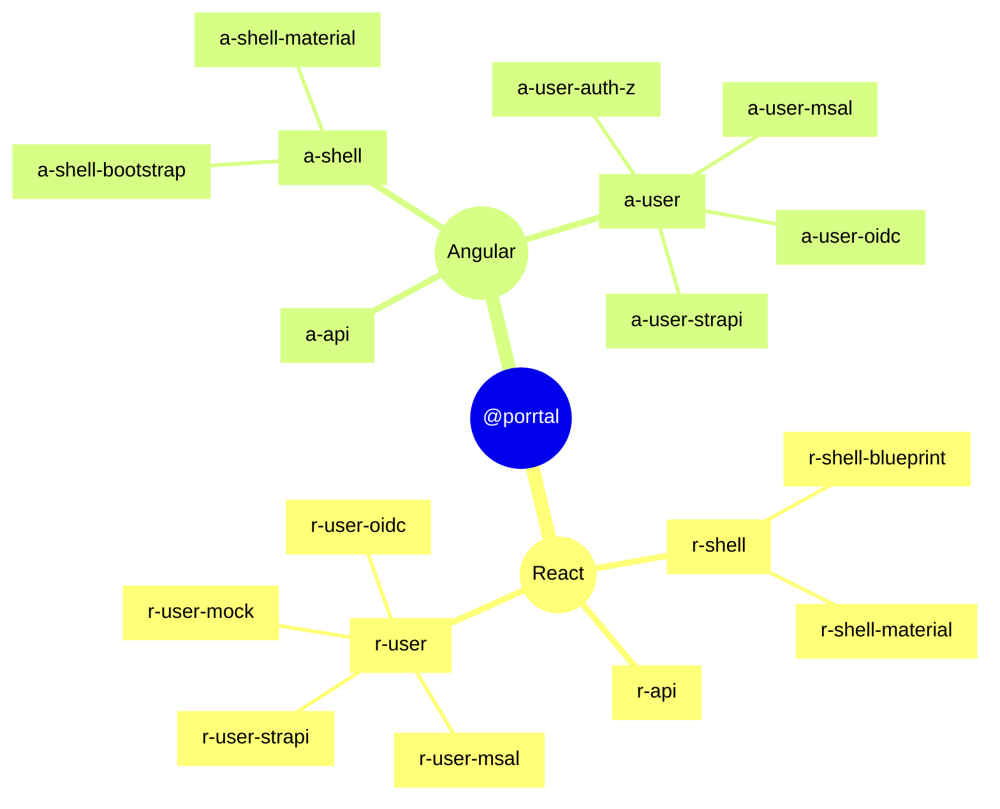
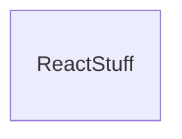
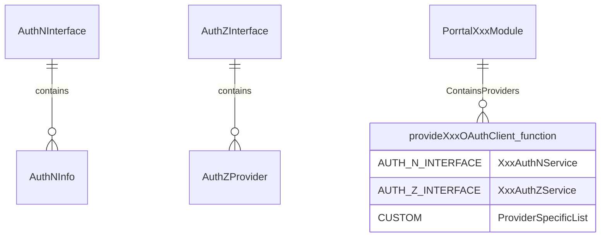

# @porrtal libraries

## react (r-*)

The [@porrtal npm packages for React](https://www.npmjs.com/search?q=%40porrtal%2Fr-) all start with "r-".  The authentication and authorization ("user") libraries all start with "r-user".

### react authentication and authorization

|library|technology|title|description|
|----|----|----|----|
|r-user|react|authentication and authorization|...|
|r-user-mock|react - mock|mock authentication support (for development)|...|
|r-user-msal|react - azure|microsoft authentication support|...|
|r-user-auth0|react - auth0|react auth0 library support|...|
|r-user-keycloak|react - keycloak|react keycloak library support|...|
|r-user-strapi|react - strapi|strapi authentication support|...|

## Angular (a-*) packages

The [@porrtal npm packages for Angular](https://www.npmjs.com/search?q=%40porrtal%2Fa-) all start with "a-".  The authentication and authorization ("user") libraries all start with "a-user".

### Angular porrtal-auth: Example Applications

To illustrate the use of the @porrtal/a-user* libraries, a set of example applications have been added to the [porrtal GitHub repository](../../apps/porrtal-auth)

#### Microsoft Azure Authentication (MSAL) Angular

MSAL for Angular enables Angular web applications to authenticate users using Azure AD work and school accounts (AAD), Microsoft personal accounts (MSA) and social identity providers like Facebook, Google, LinkedIn, Microsoft accounts, etc. through Azure AD B2C service. It also enables your app to get tokens to access Microsoft Cloud services such as Microsoft Graph.

##### MSAL Angular Links
* [Microsoft Authentication Library (MSAL)](https://github.com/AzureAD/microsoft-authentication-library-for-js/tree/dev/lib/msal-angular#microsoft-authentication-library-for-angular)

##### MSAL Angular Code Setup

1. [Create Application Module](../../apps/porrtal-auth/a-msal-app/src/app/app.module.ts#L26-L40)
2. [Create msal-config](../../apps/porrtal-auth/a-msal-app/src/app/msal-config-example.ts#L18-L38)
1. [Set Permissions in Views](../../apps/porrtal-auth/a-msal-app/src/app/pages/page-one/page-one.component.ts#L96)
2. [Create Main Component Class](../../apps/porrtal-auth/a-msal-app/src/app/pages/page-one/page-one.component.ts#L108-L137)

#### OIDC Angular - Keycloak

Keycloak provides open source identity and access management, so that you can add authentication to applications and secure services with minimum effort.

Keycloak provides user federation, strong authentication, user management, fine-grained authorization, and more.

Users authenticate with Keycloak rather than individual applications. This means that your applications don't have to deal with login forms, authenticating users, and storing users. Once logged-in to Keycloak, users don't have to login again to access a different application.

This also applies to logout. Keycloak provides single-sign out, which means users only have to logout once to be logged-out of all applications that use Keycloak.

##### OIDC Angular - Keycloak Links
* [Keycloak Website](https://www.keycloak.org/)
* [Keycloak Guides](https://www.keycloak.org/guides) (Including Getting Started Options)
* [Configuring Keycloak](https://www.keycloak.org/server/configuration)
* [OIDC Library](https://github.com/manfredsteyer/angular-oauth2-oidc#angular-oauth2-oidc)

##### OIDC Angular - Keycloak Code Setup

1. [Create Application Module](../../apps/porrtal-auth/a-keycloak-app/src/app/app.module.ts#L26-L57)
1. [Set Permissions in Views](../../apps/porrtal-auth/a-keycloak-app/src/app/pages/page-one/page-one.component.ts#L81)
2. [Create Main Component Class](../../apps/porrtal-auth/a-keycloak-app/src/app/pages/page-one/page-one.component.ts#L104-L132)

#### OIDC Angular - Auth0

Define access roles for the end-users of your applications and APIs, and extend your authorization capabilities to implement dynamic access control.

Using Auth0, developers can connect any application written in any language or stack, and define the external identity providers, as well as integrations, that they want to use. 

Auth0 provides unmatched extensibility and support for B2B, B2C, and B2E use cases.

##### OIDC Angular - Auth0 Links
* [Auth0 Website](https://auth0.com/access-management)
* [Auth0 Get Started](https://auth0.com/signup?&signUpData=%7B%22category%22%3A%22button%22%7D)
* [OIDC Library](https://github.com/manfredsteyer/angular-oauth2-oidc#angular-oauth2-oidc)

##### OIDC Angular - Auth0 Code Setup

1. [Create Application Module](../../apps/porrtal-auth/a-auth0-app/src/app/app.module.ts#L25-L55)
1. [Set Permissions in Views](../../apps/porrtal-auth/a-auth0-app/src/app/pages/page-one/page-one.component.ts#L81)
2. [Create Main Component Class](../../apps/porrtal-auth/a-auth0-app/src/app/pages/page-one/page-one.component.ts#L104-L132)

#### Strapi Angular

Strapi is an open-source headless CMS. It’s 100% Javascript, fully customizable and developer-first.

Strapi is an open-source headless content management system (CMS) that can be customized to suit any needs. It allows developers to easily build, manage, and distribute content across any device or platform. Being built on JavaScript, it uses Node.js for the backend and can work with any front-end system (React, Angular, Vue, etc.) or mobile applications, thus making it a good option for developers looking to create APIs.

Strapi provides an effective end-user management system, built on a role-based access control (RBAC) model. It includes built-in user authentication (with registration, login, and password reset functions), and supports third-party authentication providers via plugins. User roles and permissions, which define what actions users can perform on different content types, can be easily managed through the admin dashboard. The system offers varying levels of content access control based on these roles and permissions. Additionally, Strapi's authentication and authorization flows are customizable, allowing developers to tailor them to their specific needs.

##### Strapi Angular Links
* [Strapi Website](https://strapi.io/)
* [Strapi Quick Start Guide](https://docs.strapi.io/dev-docs/quick-start#_1-install-strapi-and-create-a-new-project)
* [Managing End-User Accounts](https://docs.strapi.io/user-docs/users-roles-permissions/managing-end-users)

##### Strapi Angular Code Setup

1. [Create Application Module](../../apps/porrtal-auth/a-keycloak-app/src/app/app.module.ts#L26-L57)
2. [Create msal-config](../../apps/porrtal-auth/a-oidc-app/src/app/oidc-config-example.ts#L18-L38)
1. [Set Permissions in Views](../../apps/porrtal-auth/a-oidc-app/src/app/pages/page-one/page-one.component.ts#L96-L97)
2. [Create Main Component Class](../../apps/porrtal-auth/a-oidc-app/src/app/pages/page-one/page-one.component.ts#L108-L137)

### Angular Authentication and Authorization Libraries (Packages)

|library|technology|title|description|
|----|----|----|----|
|a-user|angular|authentication and authorization|...|
|a-user-auth-z|angular - azure|microsoft authentication support|...|
|a-user-msal|angular - azure|microsoft authentication support|...|
|a-user-oidc|angular - auth0 and keycloak|oidc library support (for auth0 and keycloak)|...|
|a-user-strapi|angular - strapi|strapi authentication support|...|

### Technical Notes

#### PorrtalXxxModule

this is blar

#### provideXxxOAuthClient

for another blar

#### auth n interface

blar

#### auth z interface

blar

#### auth z provider

#### Angular Module and Providers Array

blar

### Diagram

