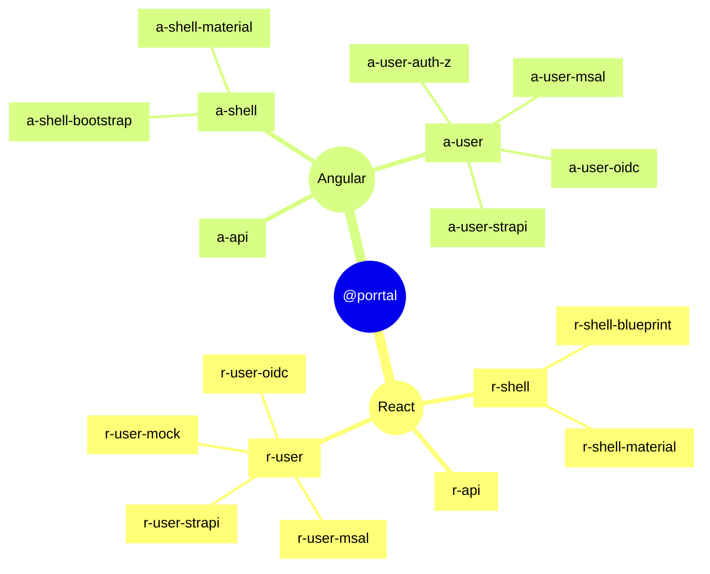
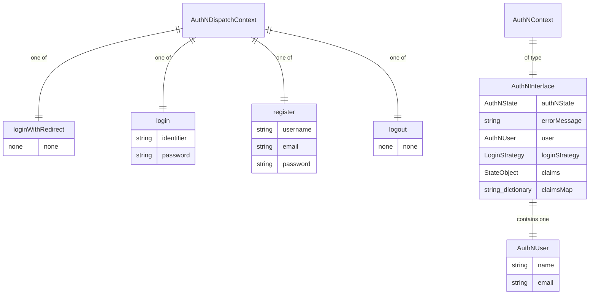
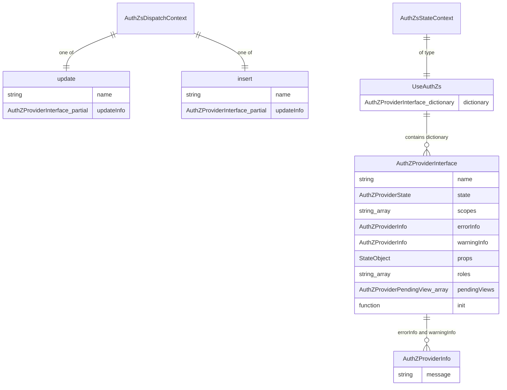
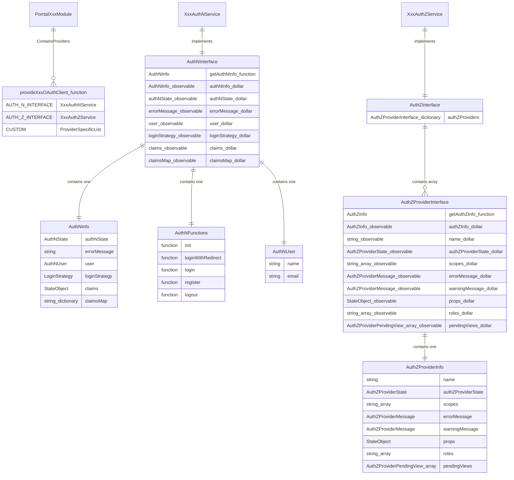

# @porrtal libraries

The [@porrtal libraries](https://www.npmjs.com/search?q=%40porrtal) can be found on npmjs.com.

The porrtal `user` libraries (libraries that start with the prefix "a-user" and "r-user") provide (optional) support for authentication and authorization in porrtal applications.

The "a-user" libraries support Angular porrtal applications.

The "r-user" libraries support React and NextJS porrtal applications.

Here is a mind map of the Angular and React porrtal libraries (the words "library" and "package" are used interchangeably to refer to a collection of capabilities that are packaged together).

This document covers sample applications and technical notes on the porrtal libraries that support the applictions.  Very likely, only specific sections will be relevant for your goals.  Here are the various sections that may be of interest:

* [User Sample Applications (Overview)](#user-sample-applications-overview)
* [React User Sample Applications](#react-user-sample-applications)
  * [r-msal-app](#r-msal-app-sample-react-application-for-microsoft-authentication-library-msal)
  * [r-keycloak-app](#r-keycloak-app-sample-react-application-for-keycloak)
  * [r-auth0-app](#r-auth0-app-sample-react-application-for-auth0)
  * [r-strapi-app](#r-strapi-app-sample-react-application-for-strapi)
* [NextJS User Sample Applications](#nextjs-user-sample-applications)
  * [n-msal-app](#n-msal-app-sample-nextjs-application-for-microsoft-authentication-library-msal)
  * [n-keycloak-app](#n-keycloak-app-sample-nextjs-application-for-keycloak)
  * [n-auth0-app](#n-auth0-app-sample-nextjs-application-for-auth0)
  * [n-strapi-app](#n-strapi-app-sample-nextjs-application-for-strapi)
* [React User Libraries](#react-user-libraries)
* [Angular User Sample Applications](#angular-user-sample-applications)
  * [a-msal-app](#a-msal-app-sample-angular-application-for-microsoft-authentication-library-msal)
  * [a-keycloak-app](#a-keycloak-app-sample-angular-application-for-keycloak)
  * [a-auth0-app](#a-auth0-app-sample-angular-application-for-auth0)
  * [a-strapi-app](#a-strapi-app-sample-angular-application-for-strapi)
* [Angular User Libraries](#angular-user-libraries)

# `User` Sample Applications (Overview)

To illustrate the use of the @porrtal `user` libraries for authentication and authorization in porrtal applications, a set of sample applications have been added to the [apps/porrtal-auth](../../apps/porrtal-auth) folder.

The naming convention for the sample applications and porrtal libraries used for these applications are as follows:

| sample application prefix | application type | porrtal libraries | npm packages |
|---|---|---|---|
| a- | Angular sample application | Angular `user` libraries: a-user* | [@porrtal npm packages for Angular](https://www.npmjs.com/search?q=%40porrtal%2Fa-) |
| r- | React sample application | React `user` libraries: r-user* | [@porrtal npm packages for React](https://www.npmjs.com/search?q=%40porrtal%2Fr-) |
| n- | NextJS sample application | React `user` libraries: r-user* | [@porrtal npm packages for React](https://www.npmjs.com/search?q=%40porrtal%2Fr-) |

The next part of the name indicates the authentication platform demonstrated in the sample application.

| name | example | authentication platform |
|---|---|---|
| MSAL | a-msal-app | [Microsoft Authentication Library (MSAL) Overview](https://learn.microsoft.com/en-us/azure/active-directory/develop/msal-overview) |
| Keycloak | a-keycloak-app | [Keycloak Website](https://www.keycloak.org/) |
| Auth0 | a-auth0-app | [Auth0 Website](https://auth0.com/access-management) |
| Strapi | a-strapi-app | [Strapi Website](https://strapi.io/) |

## Running Sample Applications

To try out one of the sample applications, you will first need to setup the authentication platform you'd like to use:
* [MSAL Setup](MsalSetup.md)
* [Keycloak Setup](KeycloakSetup.md)
* [Auth0 Setup](Auth0Setup.md)
* [Strapi Setup](StrapiSetup.md)

To run a particular sample, you will need to clone this repo, install https://nodejs.org, run `npm install --legacy-peer-deps` (from the cloned repo folder), and then run the sample:

`nx serve porrtal-auth-r-msal-app`

Notice that the name is "porrtal-auth-" plus the name of the application folder.  [Nx](https://nx.dev) concatenates the folders together to get the unique project name.

Now open your browser to https://localhost:4200 

Let's explore the sample applications for React, NextJS and Angular (starting with React).

# React `User` Sample Applications

To illustrate the use of the @porrtal/r-user* libraries in React applications, a set of sample React applications (starting with "r-") have been added to the [apps/porrtal-auth](../../apps/porrtal-auth) folder.

These React samples show how easy (and consistent) it is to add authentication and authorization to React porrtal applications using the React porrtal authentication and authorization libraries.

Sample React applications are shown for
* [Microsoft Authentication Library (MSAL)](#r-msal-app-sample-react-application-for-microsoft-authentication-library-msal)
* [Keycloak](#r-keycloak-app-sample-react-application-for-keycloak)
* [Auth0](#r-auth0-app-sample-react-application-for-auth0)
* [Strapi](#r-strapi-app-sample-react-application-for-strapi)

## r-msal-app: Sample React Application for Microsoft Authentication Library (MSAL)

Microsoft's "MSAL for React" library enables React web applications to authenticate users using Azure AD work and school accounts (AAD), Microsoft personal accounts (MSA) and social identity providers like Facebook, Google, LinkedIn, Microsoft accounts, etc. through Azure AD B2C service. It also enables your app to get tokens to access Microsoft Cloud services such as Microsoft Graph.

The porrtal React library, [r-user-msal](r-user-msal), wraps the MSAL for React library, simplifying the process of adding Azure AD support to a porrtal application.

The porrtal MSAL React sample application, [r-msal-app](../../apps/porrtal-auth/r-msal-app) illustrates how to setup a porrtal React application to support Azure AD authentication.

### MSAL React Links
* [Microsoft Authentication Library (MSAL) for React](https://github.com/AzureAD/microsoft-authentication-library-for-js/tree/dev/lib/msal-react#microsoft-authentication-library-for-react)
* [Microsoft Authentication Library (MSAL) for React - Getting Started](https://github.com/AzureAD/microsoft-authentication-library-for-js/blob/dev/lib/msal-react/docs/getting-started.md#getting-started)
* [MSAL Setup](MsalSetup.md)

### MSAL React Code Setup

1. [Create msal-config](../../apps/porrtal-auth/r-msal-app/src/app/msal-config-example.ts#L16-L43)
1. [Set Permissions in Views](../../apps/porrtal-auth/r-msal-app/src/app/app.tsx#L64)
1. [Create App Component Function](../../apps/porrtal-auth/r-msal-app/src/app/app.tsx#L112-L131)

## r-keycloak-app: Sample React Application for Keycloak

Keycloak provides self-hosted open source identity and access management, so that you can add authentication to applications and secure services with minimum effort.

Keycloak provides user federation, strong authentication, user management, fine-grained authorization, and more.

Users authenticate with Keycloak rather than individual applications. This means that your applications don't have to deal with login forms, authenticating users, and storing users. Once logged-in to Keycloak, users don't have to login again to access a different application.

This also applies to logout. Keycloak provides single-sign out, which means users only have to logout once to be logged-out of all applications that use Keycloak.

There are a number of hosted Keycloak services also.  A link is provided below to Keycloak on Amazon Web Services.

Support for Keycloak is provided by the React porrtal library, [r-user-keycloak](r-user-keycloak), which leverages the @react-keycloak/web npm package (linked below).

### Keycloak React Links
* [Keycloak Website](https://www.keycloak.org/)
* [Keycloak Guides](https://www.keycloak.org/guides) (Including Getting Started Options)
* [Configuring Keycloak](https://www.keycloak.org/server/configuration)
* [Keycloak on Amazon Web Services](https://www.amazonaws.cn/en/solutions/keycloak-on-aws/)
* [Keycloak React Library @react-keycloak/web](https://www.npmjs.com/package/@react-keycloak/web)
* [Keycloak Setup](KeycloakSetup.md)

### Keycloak React Code Setup

1. [Set Permissions in Views](../../apps/porrtal-auth/r-keycloak-app/src/app/app.tsx#L64)
2. [Create App Component Function](../../apps/porrtal-auth/r-keycloak-app/src/app/app.tsx#L112-L130)

## r-auth0-app: Sample React Application for Auth0

With Auth0's hosted authentication service, you can easily setup and manage authentication and authorization for your organization.

You can define access roles for the end-users of your applications and APIs, and extend your authorization capabilities to implement dynamic access control.

Using Auth0, developers can connect any application written in any language or stack, and define the external identity providers, as well as integrations, that they want to use. 

Auth0 provides extensibility and support for B2B, B2C, and B2E use cases.

Support for Auth0 in porrtal React applications is provided by the React porrtal library, [r-user-auth0](r-user-auth0), which leverages the Auth0 React Library (linked below).

### Auth0 React Links
* [Auth0 Website](https://auth0.com/access-management)
* [Auth0 Get Started](https://auth0.com/signup?&signUpData=%7B%22category%22%3A%22button%22%7D)
* [Auth0 React Library @auth0/auth0-react](https://github.com/auth0/auth0-react#readme)
* [Auth0 Setup](Auth0Setup.md)

### Auth0 React Code Setup

1. [Set Permissions in Views](../../apps/porrtal-auth/r-auth0-app/src/app/app.tsx#L63)
2. [Create App Component Function](../../apps/porrtal-auth/r-auth0-app/src/app/app.tsx#L111-L128)

## r-strapi-app: Sample React Application for Strapi

Strapi is an open-source headless CMS. It’s 100% Javascript, fully customizable and developer-first.

Strapi can be customized to suit any need. It allows developers to easily build, manage, and distribute content across any device or platform. Being built on JavaScript, it uses Node.js for the backend and can work with any front-end system (React, Angular, Vue, etc.) or mobile applications, thus making it a good option for developers looking to create APIs.

Strapi provides an effective end-user management system, built on a role-based access control (RBAC) model. It includes built-in user authentication (with registration, login, and password reset functions), and supports third-party authentication providers via plugins. User roles and permissions, which define what actions users can perform on different content types, can be easily managed through the admin dashboard. The system offers varying levels of content access control based on these roles and permissions. Additionally, Strapi's authentication and authorization flows are customizable, allowing developers to tailor them to their specific needs.

Support for Strapi in React porrtal applications is provided by the React Strapi porrtal library, [r-user-strapi](r-user-strapi), which leverages the Strapi REST API.

### Strapi Links
* [Strapi Website](https://strapi.io/)
* [Strapi Quick Start Guide](https://docs.strapi.io/dev-docs/quick-start#_1-install-strapi-and-create-a-new-project)
* [Managing End-User Accounts](https://docs.strapi.io/user-docs/users-roles-permissions/managing-end-users)
* [Strapi Setup](StrapiSetup.md)

### Strapi React Code Setup

1. [Set Permissions in Views](../../apps/porrtal-auth/r-strapi-app/src/app/app.tsx#L62)
2. [Create App Component Function](../../apps/porrtal-auth/r-strapi-app/src/app/app.tsx#L110-L126)

# NextJS `User` Sample Applications

To illustrate the use of the @porrtal/r-user* React libraries in NextJS applications, a set of sample NextJS applications (starting with "n-") have been added to the [apps/porrtal-auth](../../apps/porrtal-auth) folder.

These NextJS samples show how easy (and consistent) it is to add authentication and authorization to NextJS porrtal applications using the React porrtal authentication and authorization libraries.

Sample NextJS applications are shown for
* [Microsoft Authentication Library (MSAL)](#n-msal-app-sample-nextjs-application-for-microsoft-authentication-library-msal)
* [Keycloak](#n-keycloak-app-sample-nextjs-application-for-keycloak)
* [Auth0](#n-auth0-app-sample-nextjs-application-for-auth0)
* [Strapi](#n-strapi-app-sample-nextjs-application-for-strapi)

## n-msal-app: Sample NextJS Application for Microsoft Authentication Library (MSAL)

Microsoft's "MSAL for React" library enables React web applications to authenticate users using Azure AD work and school accounts (AAD), Microsoft personal accounts (MSA) and social identity providers like Facebook, Google, LinkedIn, Microsoft accounts, etc. through Azure AD B2C service. It also enables your app to get tokens to access Microsoft Cloud services such as Microsoft Graph.

The porrtal React library, [r-user-msal](r-user-msal), wraps the MSAL for React library, simplifying the process of adding Azure AD support to a porrtal application.

The porrtal MSAL React sample application, [n-msal-app](../../apps/porrtal-auth/n-msal-app) illustrates how to setup a porrtal NextJS application to support Azure AD authentication.

### MSAL React Links
* [Microsoft Authentication Library (MSAL) for React](https://github.com/AzureAD/microsoft-authentication-library-for-js/tree/dev/lib/msal-react#microsoft-authentication-library-for-react)
* [Microsoft Authentication Library (MSAL) for React - Getting Started](https://github.com/AzureAD/microsoft-authentication-library-for-js/blob/dev/lib/msal-react/docs/getting-started.md#getting-started)
* [MSAL Setup](MsalSetup.md)

### MSAL React Code Setup

1. [Create msal-config](../../apps/porrtal-auth/n-msal-app/msal-config-example.ts#L16-L43)
1. [Set Permissions in Views](../../apps/porrtal-auth/n-msal-app/pages/index.tsx#L62)
2. [Create App Component Function](../../apps/porrtal-auth/n-msal-app/pages/index.tsx#L110-L149)

## n-keycloak-app: Sample NextJS Application for Keycloak

Keycloak provides self-hosted open source identity and access management, so that you can add authentication to applications and secure services with minimum effort.

Keycloak provides user federation, strong authentication, user management, fine-grained authorization, and more.

Users authenticate with Keycloak rather than individual applications. This means that your applications don't have to deal with login forms, authenticating users, and storing users. Once logged-in to Keycloak, users don't have to login again to access a different application.

This also applies to logout. Keycloak provides single-sign out, which means users only have to logout once to be logged-out of all applications that use Keycloak.

There are a number of hosted Keycloak services also.  A link is provided below to Keycloak on Amazon Web Services.

Support for Keycloak is provided by the React porrtal library, [r-user-keycloak](r-user-keycloak), which leverages the @react-keycloak/web npm package (linked below).

### Keycloak React Links
* [Keycloak Website](https://www.keycloak.org/)
* [Keycloak Guides](https://www.keycloak.org/guides) (Including Getting Started Options)
* [Configuring Keycloak](https://www.keycloak.org/server/configuration)
* [Keycloak on Amazon Web Services](https://www.amazonaws.cn/en/solutions/keycloak-on-aws/)
* [@react-keycloak/web](https://www.npmjs.com/package/@react-keycloak/web)
* [Keycloak Setup](KeycloakSetup.md)

### Keycloak React Code Setup

1. [Set Permissions in Views](../../apps/porrtal-auth/n-keycloak-app/pages/index.tsx#L61)
2. [Create App Component Function](../../apps/porrtal-auth/n-keycloak-app/pages/index.tsx#L109-L143)

## n-auth0-app: Sample NextJS Application for Auth0

With Auth0's hosted authentication service, you can easily setup and manage authentication and authorization for your organization.

You can define access roles for the end-users of your applications and APIs, and extend your authorization capabilities to implement dynamic access control.

Using Auth0, developers can connect any application written in any language or stack, and define the external identity providers, as well as integrations, that they want to use. 

Auth0 provides extensibility and support for B2B, B2C, and B2E use cases.

Support for Auth0 in porrtal React applications is provided by the React porrtal library, [r-user-auth0](r-user-auth0), which leverages the Auth0 React Library (linked below).

### Auth0 React Links
* [Auth0 Website](https://auth0.com/access-management)
* [Auth0 Get Started](https://auth0.com/signup?&signUpData=%7B%22category%22%3A%22button%22%7D)
* [Auth0 React Library @auth0/auth0-react](https://github.com/auth0/auth0-react#readme)
* [Auth0 Setup](Auth0Setup.md)

### Auth0 React Code Setup

1. [Set Permissions in Views](../../apps/porrtal-auth/n-auth0-app/pages/index.tsx#L61)
2. [Create App Component Function](../../apps/porrtal-auth/n-auth0-app/pages/index.tsx#L110-L153)

## n-strapi-app: Sample NextJS Application for Strapi

Strapi is an open-source headless CMS. It’s 100% Javascript, fully customizable and developer-first.

Strapi can be customized to suit any need. It allows developers to easily build, manage, and distribute content across any device or platform. Being built on JavaScript, it uses Node.js for the backend and can work with any front-end system (React, Angular, Vue, etc.) or mobile applications, thus making it a good option for developers looking to create APIs.

Strapi provides an effective end-user management system, built on a role-based access control (RBAC) model. It includes built-in user authentication (with registration, login, and password reset functions), and supports third-party authentication providers via plugins. User roles and permissions, which define what actions users can perform on different content types, can be easily managed through the admin dashboard. The system offers varying levels of content access control based on these roles and permissions. Additionally, Strapi's authentication and authorization flows are customizable, allowing developers to tailor them to their specific needs.

Support for Strapi in NextJS porrtal applications is provided by the React Strapi porrtal library, [r-user-strapi](r-user-strapi), which leverages the Strapi REST API.

### Strapi Links
* [Strapi Website](https://strapi.io/)
* [Strapi Quick Start Guide](https://docs.strapi.io/dev-docs/quick-start#_1-install-strapi-and-create-a-new-project)
* [Managing End-User Accounts](https://docs.strapi.io/user-docs/users-roles-permissions/managing-end-users)
* [Strapi Setup](StrapiSetup.md)

### Strapi NextJS Code Setup

1. [Set Permissions in Views](../../apps/porrtal-auth/n-strapi-app/pages/index.tsx#L61)
2. [Create App Component Function](../../apps/porrtal-auth/n-strapi-app/pages/index.tsx#L110-L149)

# React `User` Libraries

Now let's take a deeper look at the porrtal React `user` libraries that support the above React and NextJS sample applications.

|library|technology|title|
|----|----|----|
|r-user|react|authentication and authorization|
|r-user-msal|react - azure|microsoft authentication support|
|r-user-keycloak|react - keycloak|react keycloak library support|
|r-user-auth0|react - auth0|react auth0 library support|
|r-user-strapi|react - strapi|strapi authentication support|

## AuthZProviders and the porrtal shell

AuthZProviders perform the authorization function, providing role-based access to porrtal views.  A porrtal app can have multiple AuthZProviders.

Each AuthZProvider registers itself with the porrtal shell.

At application startup, any porrtal views that define the `permisssions` property (who's syntax is [provider name]:[required permission]), will be held in an array until the corresponding AuthZProvider registers itself with the shell.

Part of the registration includes a "checkPermissions" function that accepts the [required permission] string and returns true if the requirement is satisfied, or false if the required permission is not met.

Typically, the [required permission] is a role and the checkPermissions function returns true if the authenticated user has the role in the authorization (auth z) provider, and false if the user does not have the role.

This is how a porrtal application can load different views depending on the roles of the authenticated user.  The application may look very different for users that are in different roles.

## Diagram

## Hierarchy Produced by XxxAuthentication

To make it easy to consume the various supported authentication and authorization systems (MSAL, Auth0, Keycloak, and Strapi), you just include the XxxAuthentication component, setting the appropriate properties.  To see it in action, have a looka at the React and NextJS sample applications.  Including XxxAuthentication automatically sets up the proper component/context hierarchy as follows:

* XxxAuthentication
  * CustomProvider (hooks into MSAL, Auth0, Keycloak or Strapi)
    * XxxAdapter
      * AuthNContext
        * AuthNDispatchContext
          * AuthZs
            * AuthZsStateContext
              * AuthZsDispatchContext
                * XxxAuthZ

The CustomProvider is used by the XxxAdapter to implement the authentication flow, which updates the AuthNContext and AuthNDispatchContext values. AuthNContext and AuthNDispatchContext provide a homogeneous authentication api to the application (one which works for each authentication system: MSAL, Auth0, Keycloak, and Strapi).  Specifically, the shell can display the user name and provide login, logout, register, and other operations appropriate for the chosen authentication system.

The AuthZs component sets up the values for the AuthZsStateContext and AuthZsDispatchContext.  The AuthZsStateContext is a dictionary of AuthZ providers.  The AuthZsDispatchContext is used to update the dictionary.  This allows individual AuthZ providers to register themselves.  Standard AuthZ providers can be automatically registered and additional AuthZ providers can be setup in the outer application component (as needed).

Typically, each authentication system comes with a corresponding AuthZ provider (registered as the "primary" AuthZ entry in the dictionary).

The AuthZ providers register themselves with the shell so that the shell can determine if porrtal views have the required permissions to be loaded.

# Angular `User` Sample Applications

Next, let's switch gears and look at porrtal `user` sample applications and libraries for Angular, starting with the Angular `user` sample applications.

To illustrate the use of the porrtal Angular `user` libraries (@porrtal/a-user*), a set of sample Angular applications (starting with "a-") have been added to the [apps/porrtal-auth](../../apps/porrtal-auth) folder.

These Angular samples show how easy (and consistent) it is to add authentication and authorization to Angular porrtal applications using the Angular porrtal authentication and authorization libraries.

Sample Angular applications are shown for
* [Microsoft Authentication Library (MSAL)](#a-msal-app-sample-angular-application-for-microsoft-authentication-library-msal)
* [Keycloak](#a-keycloak-app-sample-angular-application-for-keycloak)
* [Auth0](#a-auth0-app-sample-angular-application-for-auth0)
* [Strapi](#a-strapi-app-sample-angular-application-for-strapi)

## a-msal-app: Sample Angular Application for Microsoft Authentication Library (MSAL)

MSAL for Angular enables Angular web applications to authenticate users using Azure AD work and school accounts (AAD), Microsoft personal accounts (MSA) and social identity providers like Facebook, Google, LinkedIn, Microsoft accounts, etc. through Azure AD B2C service. It also enables your app to get tokens to access Microsoft Cloud services such as Microsoft Graph.

The porrtal Angular library, [a-user-msal](a-user-msal), wraps the MSAL for Angular library, simplifying the process of adding Azure AD support to a porrtal application.

The porrtal MSAL Angular sample illustrates how to setup a porrtal Angular application to support Azure AD authentication.

Support for MSAL is provided by the Angular porrtal library, [a-user-msal](a-user-msal), which leverages the MSAL for Angular library (linked below).

### MSAL Angular Links
* [Microsoft Authentication Library (MSAL) for Angular](https://github.com/AzureAD/microsoft-authentication-library-for-js/tree/dev/lib/msal-angular#microsoft-authentication-library-for-angular)
* [MSAL Setup](MsalSetup.md)

### MSAL Angular Code Setup

1. [Create Application Module](../../apps/porrtal-auth/a-msal-app/src/app/app.module.ts#L26-L40)
2. [Create msal-config](../../apps/porrtal-auth/a-msal-app/src/app/msal-config-example.ts#L16-L43)
1. [Set Permissions in Views](../../apps/porrtal-auth/a-msal-app/src/app/pages/page-one/page-one.component.ts#L96)
2. [Create Main Component Class](../../apps/porrtal-auth/a-msal-app/src/app/pages/page-one/page-one.component.ts#L108-L137)

## a-keycloak-app: Sample Angular Application for Keycloak

Keycloak provides open source identity and access management, so that you can add authentication to applications and secure services with minimum effort.

Keycloak provides user federation, strong authentication, user management, fine-grained authorization, and more.

Users authenticate with Keycloak rather than individual applications. This means that your applications don't have to deal with login forms, authenticating users, and storing users. Once logged-in to Keycloak, users don't have to login again to access a different application.

This also applies to logout. Keycloak provides single-sign out, which means users only have to logout once to be logged-out of all applications that use Keycloak.

Support for Keycloak is provided by the Angular porrtal library, [a-user-oidc](a-user-oidc), which leverages the OIDC Library (linked below).

### Keycloak Angular Links
* [Keycloak Website](https://www.keycloak.org/)
* [Keycloak Guides](https://www.keycloak.org/guides) (Including Getting Started Options)
* [Configuring Keycloak](https://www.keycloak.org/server/configuration)
* [OIDC Library](https://github.com/manfredsteyer/angular-oauth2-oidc#angular-oauth2-oidc)
* [Keycloak Setup](KeycloakSetup.md)

### Keycloak Angular Code Setup

1. [Create Application Module](../../apps/porrtal-auth/a-keycloak-app/src/app/app.module.ts#L26-L57)
1. [Set Permissions in Views](../../apps/porrtal-auth/a-keycloak-app/src/app/pages/page-one/page-one.component.ts#L81)
2. [Create Main Component Class](../../apps/porrtal-auth/a-keycloak-app/src/app/pages/page-one/page-one.component.ts#L104-L132)

## a-auth0-app: Sample Angular Application for Auth0

Define access roles for the end-users of your applications and APIs, and extend your authorization capabilities to implement dynamic access control.

Using Auth0, developers can connect any application written in any language or stack, and define the external identity providers, as well as integrations, that they want to use. 

Auth0 provides unmatched extensibility and support for B2B, B2C, and B2E use cases.

Support for Auth0 is provided by the Angular porrtal library, [a-user-oidc](a-user-oidc), which leverages the OIDC Library (linked below).

### Auth0 Angular Links
* [Auth0 Website](https://auth0.com/access-management)
* [Auth0 Get Started](https://auth0.com/signup?&signUpData=%7B%22category%22%3A%22button%22%7D)
* [OIDC Library](https://github.com/manfredsteyer/angular-oauth2-oidc#angular-oauth2-oidc)
* [Auth0 Setup](Auth0Setup.md)

### Auth0 Angular Code Setup

1. [Create Application Module](../../apps/porrtal-auth/a-auth0-app/src/app/app.module.ts#L25-L55)
1. [Set Permissions in Views](../../apps/porrtal-auth/a-auth0-app/src/app/pages/page-one/page-one.component.ts#L81)
2. [Create Main Component Class](../../apps/porrtal-auth/a-auth0-app/src/app/pages/page-one/page-one.component.ts#L104-L132)

## a-strapi-app: Sample Angular Application for Strapi

Strapi is an open-source headless CMS. It’s 100% Javascript, fully customizable and developer-first.

Strapi is an open-source headless content management system (CMS) that can be customized to suit any needs. It allows developers to easily build, manage, and distribute content across any device or platform. Being built on JavaScript, it uses Node.js for the backend and can work with any front-end system (React, Angular, Vue, etc.) or mobile applications, thus making it a good option for developers looking to create APIs.

Strapi provides an effective end-user management system, built on a role-based access control (RBAC) model. It includes built-in user authentication (with registration, login, and password reset functions), and supports third-party authentication providers via plugins. User roles and permissions, which define what actions users can perform on different content types, can be easily managed through the admin dashboard. The system offers varying levels of content access control based on these roles and permissions. Additionally, Strapi's authentication and authorization flows are customizable, allowing developers to tailor them to their specific needs.

Support for Strapi is provided by the Angular porrtal library, [a-user-strapi](a-user-strapi), which leverages the Strapi REST API.

### Strapi Angular Links
* [Strapi Website](https://strapi.io/)
* [Strapi Quick Start Guide](https://docs.strapi.io/dev-docs/quick-start#_1-install-strapi-and-create-a-new-project)
* [Managing End-User Accounts](https://docs.strapi.io/user-docs/users-roles-permissions/managing-end-users)
* [Strapi Setup](StrapiSetup.md)

### Strapi Angular Code Setup

1. [Create Application Module](../../apps/porrtal-auth/a-keycloak-app/src/app/app.module.ts#L26-L57)
2. [Create msal-config](../../apps/porrtal-auth/a-oidc-app/src/app/oidc-config-example.ts#L18-L38)
1. [Set Permissions in Views](../../apps/porrtal-auth/a-oidc-app/src/app/pages/page-one/page-one.component.ts#L96-L97)
2. [Create Main Component Class](../../apps/porrtal-auth/a-oidc-app/src/app/pages/page-one/page-one.component.ts#L108-L137)

# Angular `User` Libraries

Now that we've seen the Angular authentication and authorization sample applications, lets dig into the technical details of the Angular porrtal libraries that make this possible.

|library|technology|description|
|----|----|----|
|a-user|angular|authentication and authorization interfaces|
|a-user-msal|angular - azure|microsoft authentication and authorization support|
|a-user-oidc|angular - auth0 and keycloak|oidc library support (for auth0 and keycloak)|
|a-user-strapi|angular - strapi|strapi authentication and authorization support|

## Technical Notes

The goal of the @porrtal/a-user-* libraries is to make it easy (and consistent) to add authentication to an Angular porrtal application.

In the following table, the elements of each Angular porrtal `a-user-*` library are identified and described.  "Xxx" is one of "Msal", "Oidc", or "Strapi"

|item|description|
|----|----|
|PorrtalXxxModule|Module to import for apps that use modules|
|provideXxxOAuthClient|Function that returns an array of providers.  Can be used with stand alone components.  Also used by PorrtalXxxModule to get the providers|
|XxxAuthNService|authentication support|
|XxxAuthZService|array of authorization providers|
|XxxAuthZProvider|authorization support|

## AuthZProviders and the porrtal shell

AuthZProviders perform the authorization function, providing role-based access to porrtal views.  A porrtal app can have multiple AuthZProviders.

Each AuthZProvider registers itself with the porrtal shell.

At application startup, any porrtal views that define the `permisssions` property (who's syntax is [provider name]:[required permission]), will be held in an array until the corresponding AuthZProvider registers itself with the shell.

Part of the registration includes a "checkPermissions" function that accepts the [required permission] string and returns true if the requirement is satisfied, or false if the required permission is not met.

Typically, the [required permission] is a role and the checkPermissions function returns true if the authenticated user has the role in the authorization (auth z) provider, and false if the user does not have the role.

This is how a porrtal application can load different views depending on the roles of the authenticated user.  The application may look very different for users that are in different roles.

## Diagram

