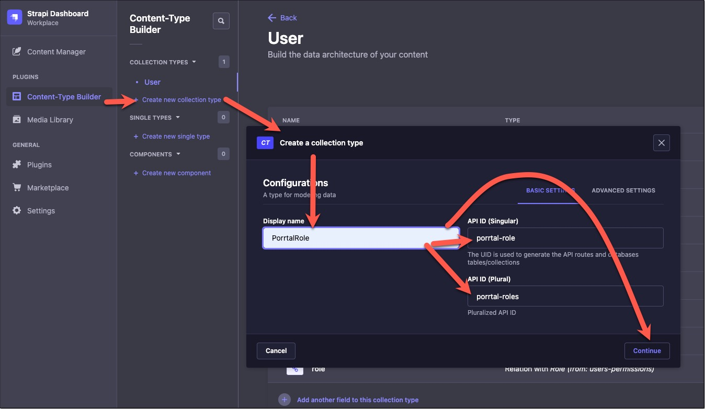
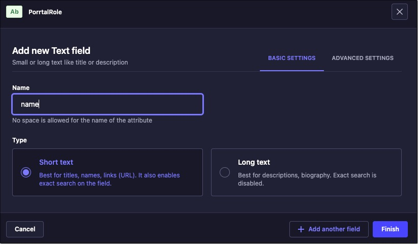
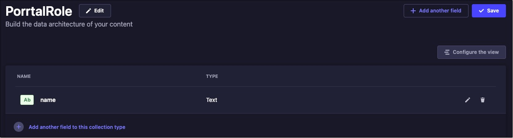
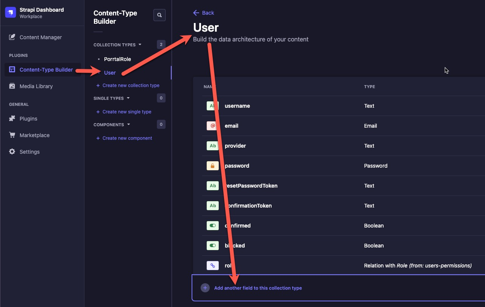
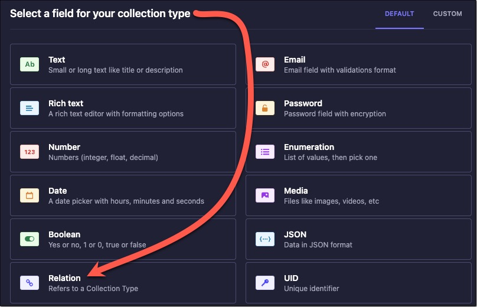
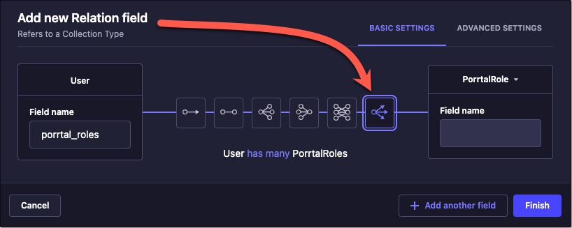
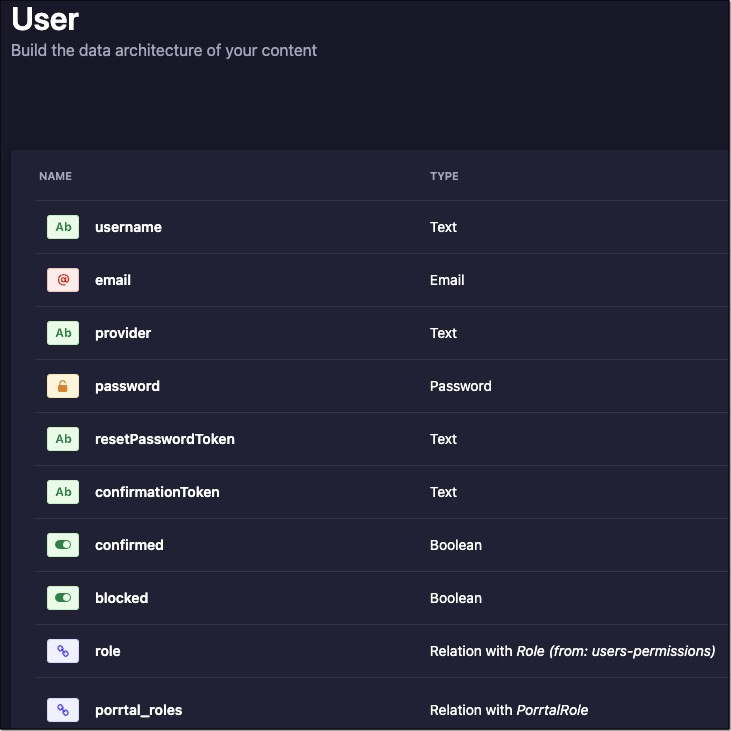
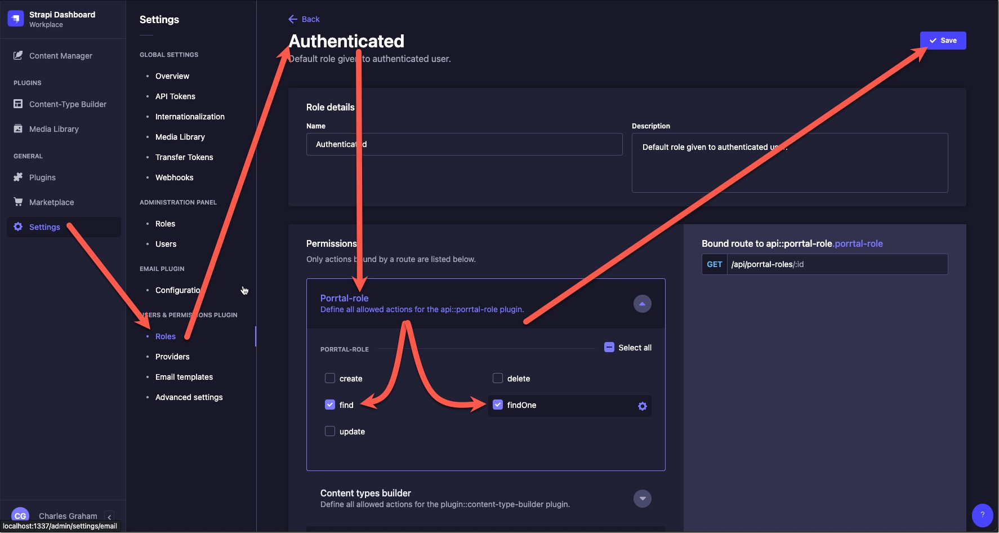
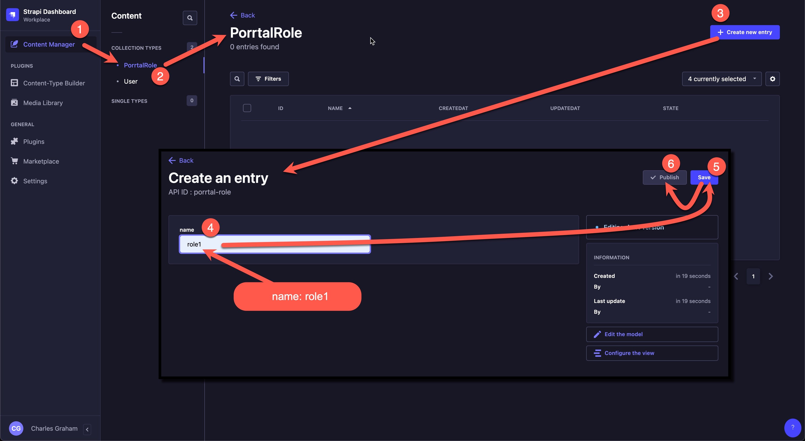
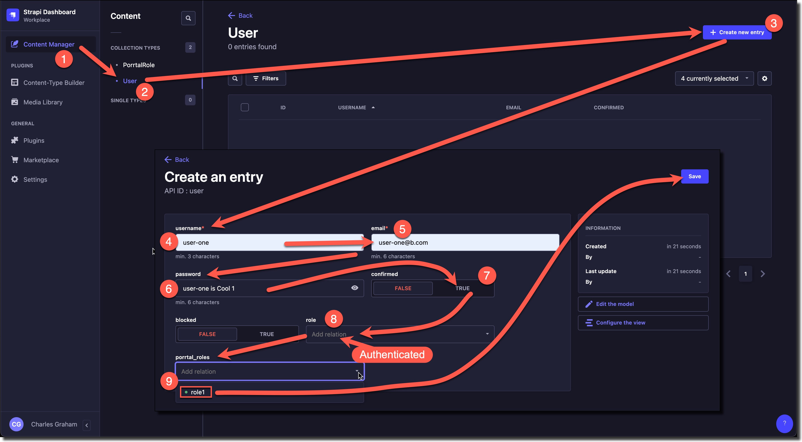

# Strapi Setup

[Strapi](https://strapi.io/) is an open-source, JavaScript-based, headless Content Management System (CMS) that allows developers to design APIs fast and manage content easily. It provides a customizable admin panel for managing content, users, and permissions. Strapi supports RESTful and GraphQL APIs out of the box and offers flexibility to choose your database, be it SQL or NoSQL.

Strapi's extensibility allows for custom plugins, enhancing functionality and integrations. The CMS includes Webhooks for real-time updates and provides multilingual support. By offering the freedom to host wherever you want, Strapi ensures you maintain full control over your data.

Strapi can be used as a complete backend for porrtal applications including managing users, content data storage, and content REST APIs.  It is also ideal for prototyping applications and getting started quickly.

## Strapi Quick Start

The [Strapi Quick Start Guid](https://docs.strapi.io/dev-docs/quick-start) will help you get up and running quickly.

Steps include:
* Install [NodeJS](https://nodejs.org)
* Run the installation script `npx create-strapi-app@latest my-project --quickstart`
* (Browser will open automatically)
* Create Strapi Admin User

Technically, that is all that is requied to begin using Strapi as a user authentication and authorization system.

Next we will look at how you can setup roles in Strapi so that porrtal views can be associated with a user's roles.

## Strapi Roles

The porrtal project adopts a convention when using Strapi to make it easy to setup and manage porrtal roles in Strapi.

### Create "PorrtalRole" Collection

### Add "name" Text Field to "PorrtalRole" Collection

### Add PorrtalRole Relation to User Collection

### Publish PorrtalRole to Authenticated Users

### Add Roles to PorrtalRole Collection

### Create user-one

## Configure OpenAPI Swagger Documentation

The [Documentation plugin](https://docs.strapi.io/dev-docs/plugins/documentation) is useful to document the available endpoints once you created an API.

The OpenAPI Swagger Documentation can be used to generate TypeScript proxy classes make it easy to programmatically interract with Strapi content in a Porrtal application.

If installed, the Documentation plugin will inspect content types and routes found on all APIs in your project and any plugin specified in the configuration. The plugin will then programmatically generate documentation to match the [OpenAPI specification](https://swagger.io/specification/). The Documentation plugin generates the [paths objects](https://github.com/OAI/OpenAPI-Specification/blob/main/versions/3.1.0.md#paths-object) and [schema objects](https://github.com/OAI/OpenAPI-Specification/blob/main/versions/3.1.0.md#schema-object) and converts all Strapi types to [OpenAPI data types](https://swagger.io/docs/specification/data-models/data-types/).

The generated documentation can be found in your application at the following path: `src/extensions/documentation/documentation/<version>/full_documentation.json`
